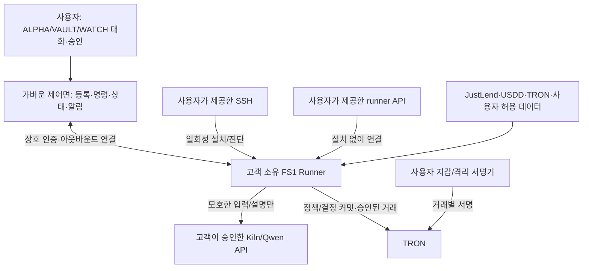

# FS1 BYON — 금융 에이전트 실행 네트워크의 GWDC 구조

> 2026-09-28 역사 문서로 전환. 사용자가 고객 소유 노드와 노드 제품화를 제외했다. 현재 기준은 [Qwen3 32B 기반 통합 웹서비스](TRON_FURIOSA_UNIFIED_ARCHITECTURE_20260928.md)이며 아래 BYON 설명은 신규 구현 지시가 아니다.

2026-09-25 · 사용자 정정 반영 v2. 제품은 **Bring Your Own Node(BYON)**다. 고객이 자기 VM/서버/노드와 접근 방법을 가져온다. 우리는 그 자원에 금융 에이전트 실행 소프트웨어를 설치하거나 고객의 runner API에 연결하고, 바깥에는 ALPHA·VAULT·WATCH가 계속 일하는 Grok Bot형 경험을 제공한다. 회사가 고객을 대신해 24시간 시장 감시·모델 추론용 서버를 공급하는 구조가 아니다. 이전 v1의 “우리가 운영하는 Cherry 노드가 고객을 처리한다”는 설명은 폐기한다. [사용자 원문 1~16 및 도입·결말 대응표](FS1_USER_TEXT_COVERAGE_20260925.md)에 해석 근거를 남긴다. **이번 대회의 실제 코드·설치·실측과 남은 합격 조건은 [GWDC BYON 대회 빌드](GWDC_BYON_CONTEST_BUILD_20260925.md)가 기준이다.**

## 제품의 두 면

**제어면 — 바깥의 개인 자산관리사.** 사용자에게는 세션 번호 대신 지속형 직원 ALPHA(계획), VAULT(출금·현금), WATCH(시장·체인 근거)가 보인다. 사용자는 자기 노드를 연결하고, 대화로 목표를 말하고, 확인한 정책·실제 작업·대기 중인 승인·결정 영수증을 본다. 제어면은 로그인, 기기/노드 등록, 직원 roster, 상태 화면, 알림 전달, 소프트웨어 업데이트를 담당한다. 포트폴리오 전체와 상시 금융 판단을 중앙에서 계산하지 않는다.

**데이터면 — 고객 소유 FS1 Runner.** 고객 노드에서 원천 수집, 버전 있는 상태, 정책 실행, 특징·트리거, 정확 계산·위험 검사, 결정 영수증, 승인 후 거래 제출/영수증 확인이 지속 실행된다. 사용자가 노드를 끄거나 접근을 회수하면 직원 상태는 `PAUSED`가 되고 감시 중이라고 표시하지 않는다. 운영 비용(노드·데이터 API·모델 API·TRON 수수료)은 고객 자원에서 발생하며 제품은 이를 흐름별로 계측한다. 제어면 이용/업데이트와 선택적 증명 네트워크는 별도 제품 과금 대상이 될 수 있으나 가격은 아직 정하지 않았다.



SSH 모드에서는 사용자가 지정한 제한 계정/일시 자격으로 runner를 **설치·업데이트·진단**한다. 최초 설치 후 runner가 제어면으로 아웃바운드 상호 인증 연결을 유지한다. 중앙에 장기 root SSH 개인키를 보관하거나 노드에 상시 원격 셸을 유지하지 않는다. API 모드는 고객이 이미 실행 중인 FS1 Runner endpoint와 범위 제한 API 키를 제공한다. **시장 데이터 API 키만 제공한 것은 컴퓨팅 노드를 제공한 것이 아니다.** 두 모드 모두 데이터·모델·거래소 키는 고객 노드의 비밀 저장소에 두고 UI/로그/LLM 프롬프트에 넣지 않는다. 지갑 시드·개인키는 수집하지 않는다. 회수·키 만료·접근 장애는 실행 중지 상태로 남긴다.

## 사용자 입력을 금융 정책으로 컴파일

Qwen 32B/Kiln은 첫 요청·조건 수정·새 약관의 모호한 의미·사용자 설명에 호출된다. 컴파일러가 자연어에서 `PolicyIR` 초안을 만들지만 **사용자 확인과 타입 검증**을 통과한 버전만 runner가 활성화한다. `PolicyIR`에는 소유자/노드 ID, TRON 네트워크, 보유 자산과 원자 단위, 기간, 시점별 현금 필요액, 허용/금지 상품, 공통 위험 한도, 최대 비용, 트리거, 허용 행동, 승인 규칙, 만료, 원문 근거, 컴파일러/규칙 버전이 포함된다. 누락값은 추정해 채우지 않고 `UNKNOWN`으로 보존한다.

대회 정책 예: “1,000 USDT 중 500은 언제든 출금 가능하게 두고, 나머지 JustLend/USDD 후보를 비교해. 공급 기본 연율과 보상은 따로 보여줘. 현금 필요액 또는 실제 출금 가능성이 달라지면 다시 계획을 열고, 입금·상환은 내 확인 전에는 하지 마.” 사용자 확인 뒤 `policy_hash`를 만들고 의존성 색인에 등록한다. 나중에 “언제든 필요한 돈을 800으로 변경”하면 v2가 되고 v1 계획·승인 후보는 만료된다. 기존 문장 전체를 매 주기 Qwen에 다시 보내지 않는다.

## 고객 노드 안의 시간·타일 경계

```text
SLOW:    대화/Qwen → PolicyIR 컴파일·수정 → 사용자 확인
FEED:    API·TRON 사건 → 원문 해시·시각·단위 검증 → typed StateDelta
HOT:     영향 색인 → feature/trigger → 정확 계산 → 위험 오라클 → typed Decision
CHAIN:   결정 서명·선택적 커밋 → 사용자 승인/지갑 서명 → TRON → 확정 영수증
```

내부 논리 타일은 `NET/FEED → DECODE → DATA ORACLE → STATE → FEATURE → TRIGGER → DECISION → RISK → ROUTER → RECEIPT`다. 서명은 별도 보안 경계의 사용자 지갑 또는 고객이 직접 관리하는 격리 서명기로 분리한다. `EXECUTE`는 명시적 승인과 사전 재검사를 통과한 거래만 처리한다. 네 시간대를 한 agent loop에 합치지 않는다.

`StateDelta`는 `(source, subject, metric, old/new canonical value, unit, quality, event_time, observed_at, block/tx/event index, raw witness)`로 고정된 타입을 갖는다. 같은 경제 값의 스냅샷 반복은 트리거 0회다. 원천 품질 악화, 재조직/정정, 단위·상품 버전 변경은 값 변화와 다른 안전 이벤트다. `fact → 상품/담보/프로토콜 위험군 → policy version → plan` 역색인이 영향받는 정책만 찾는다. 유효 변화도 히스테리시스·쿨다운·기한 긴급도에 따라 합치되 원본 사건은 모두 저널에 보관한다. 큐가 넘치면 오래된 계획을 최신처럼 사용하지 않고 `STALE/PAUSED`로 중단 후 재생한다.

TRON B의 JustLend·USDD는 현재 공식 API 10분 수집과 제한된 확정 이벤트로 관측 중이다. 이는 **데이터 신선도가 10분 수준인 경로**이며 “마이크로초 시장 감시”가 아니다. 로컬 trigger 계산 지연, 원천 도착 지연, TRON 확정 지연을 각각 측정한다. 퍼프·청산 버퍼·funding 예시는 원문 구조 설명용이며 이번 대회의 TRON 예치 상품이라고 주장하지 않는다.

## 금융 System-1 결정과 오라클

`DecisionTile` 입력은 언어 토큰이 아니라 타입 있는 market/portfolio/liquidity/risk/policy/chain 상태다. 출력은 `HOLD`, `ASK`, `REPLAN`, `PREPARE_DEPOSIT`, `PREPARE_REDEEM`, `PAUSE` 및 이유 코드, 유효기간, 선택적 보정 확률이다. **대회 v1은 결정적 조건 검사와 정확한 소규모 최적화를 우선**한다. 독립 실금융 라벨이 없는 작은 신경망의 `confidence=0.94`를 실제 신뢰도로 제시하지 않는다. 향후 검증된 모델이 기준선을 이길 경우 CPU SIMD/NPU 구현을 플러그인으로 넣을 수 있다. 무변화/명백한 조건은 모델 호출 없이 끝내고, 새 문서 의미·충돌 근거·사용자 설명만 Qwen으로 올린다.

**Data Oracle**은 출처, 주소/계약 버전, 숫자·단위, 수집/사건 시각, 체인 확정, 원천 충돌을 검증한다. **Decision Oracle**은 고정된 사용자 정책·목적함수·비용/출금 제약 아래 후보가 가능한지, 무엇을 계산으로 증명할 수 있는지 검사한다. 현재 `formal_optima.py`의 총수익 대리목표와 `allocation_oracle.py`의 제약 검사는 출발점이며 소비자에게 적합한 최적 배분/실제 거래 정답은 아니다. 비용·출금 약관·가격·체결 가능성이 비면 `NEEDS_EVIDENCE` 또는 `PAUSE`다. 노드 다수결도 누락된 사실을 만들어내지 못한다.

위험별 경로는 `(읽기/알림 → 로컬 판정)`, `(계획 재작성 → 로컬 계산+서명 영수증)`, `(입금·상환 준비 → 현재 상태 재검사+사용자 승인+로컬 지갑 서명)`, `(고액 자동 실행/정책 확대 → 별도 온체인 강제 정책과 독립 증명 네트워크가 검증될 때까지 중지)`로 둔다. 원문에 든 $100/$50,000은 보편 한도가 아니라 분기 개념의 예시다.

## 블록체인 증거와 향후 Decision Attestation Network

다섯 기록을 분리한다: `Policy Root`, `Model/Kernel Root`, `State/Data-Oracle Root`, `Decision Receipt`, `Execution Receipt`. `model_hash`는 모델 미사용 결정에서는 `null`이다. 각 Decision Receipt는 정책/상태/규칙 버전, 타입 행동, 원자 단위 금액, 이유·근거 해시, 생성/만료, 노드 서명을 포함한다. 실행 영수증은 사용자가 실제 승인·서명한 거래 ID, 브로드캐스트 응답, 확정된 TRON 영수증/이벤트, 비용을 뒤에 연결한다. 모든 tick을 체인에 쓰지 않고 고객 노드가 영수증 원문을 보유하며 필요한 묶음 Merkle root만 TRON에 커밋한다. 체인 커밋은 무결성·사후 추적 수단이며 “올바른 투자 판단”의 암호학적 증명이 아니다.

고객 노드 1개가 발행한 서명은 **단일 노드 결정**이다. 한 고객 노드에서 프로세스 3개를 돌려 2/3 quorum이라고 부르지 않는다. 장기 확장은 서로 다른 운영자·호스트·권한의 attestor가 같은 정책/상태/규칙 루트와 정규화 행동을 독립 검증하는 네트워크다. 정밀도가 다른 하드웨어의 모델 확률까지 bit 동일하다고 요구하지 않고, 정수 단위 특징/행동/제약 증명을 비교한다. 개인 포트폴리오의 독립 재현에는 정보 공개 문제가 있으므로 사용자가 허가한 정보만 attestor에 제공한다. 개인정보를 숨긴 완전한 다중 노드 검증은 미해결 연구 항목이다. 대회에는 독립 quorum이 아니라 단일 서명·재생 검사·TRON 테스트넷 커밋을 시연한다.

TRON 메인넷은 JustLend·USDD 원천 읽기용이고, 대회 쓰기 증거는 테스트넷에서 만든다. TRON의 상태 변경은 unsigned transaction 생성→**사용자 측 서명**→서명된 거래 broadcast→확정 실행 영수증 검증으로 구별한다. API 키나 SSH 권한은 지갑 승인·서명 권한이 아니다. 정책/결정 해시를 체인에 남겼다는 이유로 실제 입금 완료라고 말하지 않는다. 직접 예치 테스트넷 경로가 없으면 기록 계약 거래와 시뮬레이션 포지션을 명확히 구분한다.

## BYON 하드웨어 적응: Firedancer의 원리만 가져오기

runner 설치 시 `physical cores/SMT`, NUMA, RAM, NIC 대역/RSS/AF_XDP 가능 여부, disk/IO, HSM/NPU 여부를 **읽기 전용**으로 조사해 프로파일을 선택한다.

| 프로파일 | 고객 자원/실행 방법 | 시간·기능 경계 |
| --- | --- | --- |
| Lite | 범용 VM, Linux 네트워크·bounded queue, 소수 프로세스 | TRON B처럼 저빈도 API/체인 상태에 적합. 고속 feed·자동 거래 SLA 없음 |
| Standard | 전용 CPU 여유, 프로세스 타일·메모리 상태·사전 할당 ring | 소스·정책 수 증가 시 코어별 병목 계측, 영향 정책만 재검토 |
| Tiled | 사용자가 소유한 전용 NIC/코어, 명시적 튜닝 허가 | 코어 pinning·NUMA/IRQ·AF_XDP·zero-copy를 **각각 A/B 검증**한 후 선택 |
| Sensor offload | 사용자 소유 FPGA/SmartNIC/DPU | packet parse·시간·서명 사전검사·단순 trigger만 우선 offload, 모델 추론은 실험 뒤 결정 |

빠른 경로의 제안 메시지는 `schema_version, sequence, source_key, event/receive time, fixed-point value+unit, quality, witness_hash, state_version`이 있는 고정 길이 struct다. producer/consumer별 사전 할당 ring과 체크포인트·재생 커서를 둔다. ring이 가득 차면 출금 위험 이벤트를 조용히 버리지 않고 역압 또는 정지/복구를 한다. 외부 API에서 JSON/HTTP 파싱, 영속 저널의 DB 쓰기는 경계 타일에서 필요하다. **no JSON/no heap/no database in hot path**는 전용 장비에서 유의미한 병목으로 확인된 경우의 최적화 목표다. busy polling은 고객 CPU·전력을 상시 소비하므로 기본값이 아니다.

사용자가 제안한 고성능 전용 노드의 24~32 물리 코어/128GB ECC/25GbE+/독립 NVMe 2개는 상위 프로파일의 설계 후보지 모든 고객의 최소 사양이 아니다. 대회 시험 호스트 Cherry는 2026-09-25 확인 시 Ryzen 9 7950X **16 물리 코어/32 스레드**, 단일 NUMA, 약 124GiB RAM, **2×10GbE**, **2×894GB NVMe RAID1의 논리 디스크 하나**, 가용 디스크 약 86GB이며 다른 프로젝트와 공유된다. 소유자가 제공한 노드로 runner를 시험할 수 있지만 제품이 고객 컴퓨팅을 공급한다는 뜻이 아니다. Cherry의 NIC/IRQ/huge page/코어 격리, AF_XDP 설정을 변경하지 않는다. TRON FullNode 공식 최소 SSD 3TB에도 못 미치므로 이 호스트를 TRON FullNode라고 부르지 않는다. 대회용 NPU는 검증된 Kiln API 호출이며 Cherry 로컬 NPU를 가정하지 않는다.

## 대회에서 검증할 BYON 세로 관통 흐름

1. **가입:** 데모 소유자가 자기 Cherry 노드를 SSH로 연결하거나 준비된 FS1 Runner API 키로 등록한다. UI가 실제 CPU/NIC/메모리 프로파일, 연결/중지 상태, 키 권한 범위를 보여준다. 이것이 BYON 제품 작동 증거다. 다른 프로젝트 경로에는 설치하지 않는다.
2. **정책:** ALPHA가 실제 Kiln/Qwen 호출로 필요를 구조화하고 누락을 묻는다. 사용자 확인 후 `PolicyIR v1`과 원문-조건 연결을 사용자 노드에 저장한다. 외부 공개 Furiosa A 브리프에는 아직 `gpt-oss-120b`가 적혀 있고, 사용자의 최신 안내는 Qwen 32B다. 실제 제공 모델 ID와 endpoint는 참가자 환경에서 확인해 로그에 남긴다.
3. **감시:** JustLend·USDD 메인넷 자료와 관련 TRON 확정 이벤트를 고객 노드가 읽는다. 동일 자료에서는 트리거·재계산·모델 0회다. 값/품질 변화 때 그 상품·공통 위험에 걸린 정책만 평가한다.
4. **계획:** 같은 금액·기간에 최소 두 실행 가능한 대안을 금액/기초 수익/보상/비용/출금/위험으로 비교한다. 실원천 비용·출금 약관이 없는 대안을 “실행 가능”으로 세지 않는다. 현재 이 acceptance는 완료되지 않았다.
5. **조건 변경:** 예비 현금 500→800처럼 정책을 v2로 수정하고 v1 계획과 승인 후보를 무효화한다. 기존 주기적 전체 LLM 재실행과 BYON runner의 토큰·지연·CPU/전력 범위를 같은 조건에서 비교한다.
6. **체인:** 사용자가 승인 가능한 테스트넷 액션을 확인·지갑 서명하면 거래를 보내고 정본 영수증을 Decision/Execution Receipt와 결합한다. 실제 TRON 상품 테스트넷 경로가 없다면 기록 계약의 온체인 트랜잭션과 별도 모의 포지션이라고 표시한다. 사용자 승인/서명 전에는 보내지 않는다.
7. **검토:** ALPHA가 변경 이유, 이전/현재 정책, 기대/실제 결과, 비용, txid 및 확정 상태를 보여준다. 제3자는 개인정보 없이 커밋과 공개 영수증을 재구성할 수 있는 범위를 확인한다.

공식 TRON B는 JustLend·USDD 두 프로젝트, 사용자 필요·두 실현 가능한 계획, 비용/출구/위험, 승인 뒤 실행 보조와 이후 추적을 요구한다. Furiosa A 공개 브리프는 실제 NPU Kiln 모델 호출·흐름별 토큰/에너지 근거·devnet/testnet 온체인 거래·조건을 바꾼 두 번의 흐름을 요구한다. **문서/목업/정책 해시만으로 둘 중 어느 트랙도 충족됐다고 보고하지 않는다.** 이 대회 데모는 BYON 소프트웨어의 한 고객 노드 사례이며 독립 다중 노드 네트워크나 실자산 자율 운용의 증거가 아니다.

## 구현 경계와 검증 순서

현재 배포된 것은 10분 원천 수집·시간당 사실/연구 최적해·일별 자기지도 연구 학습에 더해, **제한된 읽기 전용 데모 PolicyIR**, 정책별 역색인·변화 반응·품질 유보·무서명 결정 해시를 가진 고객 노드 runner다. 대회 소유자 제공 Cherry에서 `gwdc-finance-fs1-runner.timer`가 이를 시간당 실행한다. 정식 BYON 등록/runner API, 사용자 확인 증거, 서명된 Decision Receipt, 온체인 기록 계약, 승인된 실행 경로, Kiln 실호출, 트랙별 end-to-end 벤치마크는 **아직 미구현/미검증**이다. 기존 FDC 신경망은 별도 연구이고 위 제품의 필수 요소가 아니다.

구축 순서는 **(1) BYON 가입·상태/권한 → (2) 사용자 확인 PolicyIR → (3) 상태 변화와 역색인/무변화 0호출 → (4) 정확 계산·오라클·결정 영수증 → (5) Kiln 실제 호출/토큰·에너지 계측 → (6) 사용자 승인과 TRON 테스트넷 영수증 → (7) replay/비교 벤치마크**다. 기능 합격 불변식은 무변화 모델 호출·정책 재계산 0, 관련 정책 누락 0, 필수 근거 누락 시 거래 준비 0, 승인/서명 없을 때 전송 0, 체인 미확정일 때 완료 표시 0이다. 성능은 p50/p95 내부 판단·외부 원천 지연·체인 확정 지연, 유효 변화당 토큰/비용, 전력 실측 또는 명시적 가정을 각각 보고한다.

## 확인한 근거

- [GWDC 행사와 두 트랙](https://luma.com/be2le0l0), [Furiosa A 공개 브리프](https://docs.google.com/document/d/13qh7oePGl7Flrl-Zh_A6hfr02L266PvS/edit), 로컬 `GWDC Korea Hackathon_ TRON Challenge Brief.pdf` 2쪽. 공개 Furiosa 모델 표기는 사용자의 최신 Qwen 32B 안내와 다르므로 실제 참가자 endpoint 검증 전까지 미확정이다.
- [Firedancer 구성과 타일](https://docs.firedancer.io/guide/configuring.html), [AF_XDP Net Tile](https://docs.firedancer.io/guide/internals/net_tile.html). 타일 원리를 참고했으며 FS1에서 동일한 성능을 달성했다는 뜻이 아니다.
- [TRON FullNode 자원 요건](https://developers.tron.network/docs/deploy-the-fullnode-or-supernode), [로컬 서명·브로드캐스트 흐름](https://developers.tron.network/docs/api-signature-and-broadcast-flow), [확정 이벤트](https://developers.tron.network/reference/get-events-by-contract-address). TRON FullNode, 고객 FS1 Runner, 중앙 UI를 서로 다른 역할로 정의한다.
