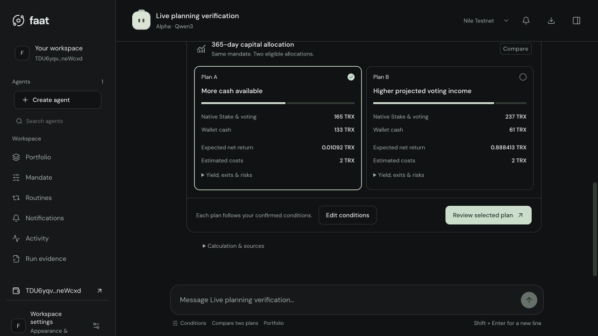

# faat

**Finance AI Agent Tron · GWDC 2026 · TRON B**

faat turns personal investment conditions into calculated TRON allocation plans, user-signed transactions and ongoing portfolio reviews. Tell your agent the budget, horizon and cash you need. Confirm the conditions once; the engine compares eligible allocations and returns the result in the conversation. Your wallet signs each reviewed transaction.

[Open the Nile app](https://machine.148-113-153-116.nip.io/?network=nile) · [Start here](docs/README.md) · [Architecture](docs/ARCHITECTURE.md) · [Evidence and limits](docs/VERIFICATION.md) · [Run locally](docs/SETUP.md)

[](https://github.com/skew-labs/gwdc2026/actions/workflows/verify.yml)



*Actual interface using the calculation engine and live Nile observations in an isolated verification workspace, September 30. Forecasts shown are variable testnet estimates; no transaction was signed in this check. [Inputs and provenance](docs/AUTOMATIC_PLANNING.md#verification-on-2026-09-30).*

## From a goal to an accountable position

1. **Describe the goal.** Create an Alpha, Vault or Watch agent. Chat captures capital, horizon, immediate cash, withdrawals and risk terms in an editable draft. The roles share a wallet-scoped workspace.
2. **Confirm and compare.** Review the conditions and click **Confirm & compare**. A durable job confirms that exact version, loads current observations and posts two eligible plans automatically. If the conditions cannot produce two valid options, the result explains what failed.
3. **Choose and sign.** Compare allocations, net income, full costs, liquidity and risks. Select a plan, review its exact actions and approve. TronLink requests the user's signature for each transaction.
4. **Verify the outcome.** The service reconciles receipts and positions. Portfolio separates forecasts, accrued income, realized income, actual fees and cumulative net P&L.
5. **Set a routine.** Watch fetches fresh state and compares keeping the position with adjusting it, including unwind and reinvestment costs. An actionable result creates an account notification and a new review.

Condition confirmation authorizes calculation. A selected plan still needs transaction approval and a wallet signature. General willingness to take risk does not authorize borrowing or widen a spending limit.

## What exists today

| Capability | Implementation and evidence | Boundary |
| --- | --- | --- |
| Conversational conditions and automatic comparison | Qwen3-32B through Kiln; editable conditions; persistent Plan A / Plan B cards; live Nile calculation verified | Two recommendations require two eligible candidates. Stale or infeasible work returns typed blockers. |
| JustLend TRX supply and redemption | **User-signed Nile round trip**, receipts and closed position reconciled | Small integration test; recorded net loss after fees. |
| Native Stake 2.0 and voting | Live reward/resource reads, allocation engine, five-action execution/recovery path, unsigned node bytes and TronWeb verification | **First user-signed native lifecycle pending.** |
| USDD issue / supply / bounded loops / unwind | Constraint, compilation, execution and recovery code; regression coverage | **Funded mainnet lifecycle pending.** Incompatible Nile Vault/JustLend token route is blocked. |
| Performance and Watch | Actual JustLend fee accounting; fresh production Watch `HOLD`; synthetic `ADJUST` notification path | Notifications require separate review and signing. Annual realized yield is unproven. |
| Multiple product families | Native Stake + cash and JustLend + cash, selected by permitted route | Joint Native Stake + JustLend portfolio optimization is future work. |

This table describes the current submission. Earlier PR records remain available as dated history.

## How the system is connected

```text
React workspace ─── user confirmation / plan choice ─── TronLink
       │                                                  │
       ▼                                                  │ signature
Node gateway ◀────────────────────────────────────────────┘
       ├── wallet proof, sessions, CSRF, scoped conversations
       ├── SQLite: agents, messages, durable planning jobs
       ├── Kiln / Qwen3-32B: editable intent + explanations
       └── authenticated finance requests
                    │
                    ▼
Python finance service + Economic Machine
       ├── fresh observations → constraints → eligible allocations
       ├── transaction graph → exact approval → signed-byte checks
       ├── durable submission → receipt → independent post-state
       └── performance ledger → Watch review → account notification
                    │                         │
                    ▼                         ▼
              PostgreSQL                 TRON / protocols
              financial records          Native Stake + voting
              reservations + journal     JustLend / USDD adapters
              Watch queue + leases       network-bound evidence

Data / research: source capture → normalization → provenance checks
                 → explicit synthetic/replay cases → oracle evaluation
```

**The model interprets; the engine calculates; the wallet signs.** SQLite planning jobs and PostgreSQL financial/Watch jobs have distinct responsibilities. Research outputs pass through the same financial gates before they can influence executable work. [Module boundaries and state transitions](docs/ARCHITECTURE.md).

## A calculated result with inspectable inputs

At **2026-09-30 01:17 UTC**, a live Nile check evaluated **101 allocations; 25 passed**. One confirmation produced the following comparison in about 10 seconds, with no additional chat prompt, signature or broadcast.

| Native Stake + cash option | Stake | Available cash | Lifecycle cost reserve | Projected net income over 365 days |
| --- | ---: | ---: | ---: | ---: |
| More cash available | 165 TRX | 133 TRX | 2 TRX | 0.010920 TRX |
| Higher voting income | 237 TRX | 61 TRX | 2 TRX | 0.888413 TRX |

Each row totals **300 TRX**. Conditions included a 20% cash floor, no borrowing and explicit staking/voting permission. The isolated test explicitly allowed full-capital loss: spending and loss caps were 300 TRX with 100% loss scenarios. Those permissive test settings are not a risk recommendation. These are dated, variable forecasts for two allocations within the same product family. [Full conditions, timing and machine-readable result](docs/AUTOMATIC_PLANNING.md).

If costs, liquidity or retained risk limits invalidate a plan, faat reports the constraint. Increasing the budget alone does not silently increase authority. [Native reward calculation and cost model](docs/NATIVE_STAKING.md).

## A transaction result with public receipts

The user signed a complete Nile JustLend supply and full redemption through TronLink.

| Operation | Principal / output | Actual fee | Evidence |
| --- | --- | ---: | --- |
| Supply | 1 TRX | 8.0894 TRX | [Supply receipt](https://nile.tronscan.org/#/transaction/877d3dcb132ff55b37f0cb24286c9ce3fce4e0966c21bdc4b0924f6d7652a7c2) |
| Redeem | 89.46435527 jTRX → 1 TRX | 7.2569 TRX | [Redemption receipt](https://nile.tronscan.org/#/transaction/b83d55426b98f73ff458e61d003f062a58d2588bbcad21b3d02ebf72f1f0d628) |

**Income before fees: 0 TRX. Actual net P&L: −15.3463 TRX.** The position reconciled as closed. This was a small integration test. Current investment entry requires positive projected net benefit; a protective exit has separate eligibility rules.

Expected net **to the same observation time** was −16.3703 TRX. The +1.024 TRX variance came from lower fees, not earned yield. A new performance period preserves the old receipts and loss. [Accounting definitions and proof scope](docs/VERIFICATION.md).

## Failure cases that shaped the implementation

| Failure observed or tested | Enforced behavior | Code / tests |
| --- | --- | --- |
| Model extraction returns `intent: null` | Preserve healthy workspace state; show an editable draft error | [Automatic planning](docs/AUTOMATIC_PLANNING.md) |
| Page closes or gateway restarts during comparison | Resume the durable job with stable confirmation/comparison keys | [Gateway and worker](frontend/server/index.ts) |
| An old 2 TRX limit survives a larger budget request | Expose the conflict; require an explicit draft change and confirmation | [Condition editor](frontend/src/App.tsx) |
| A zero-value protobuf field breaks wallet encoding | Check canonical bytes against official TronWeb serialization before signing | [Wallet encoding regression](tests/test_wallet_encoding.py) |
| Broadcast times out | Retain the reservation and reconcile the same transaction identity | [Recovery](src/finance_service/native_recovery.py) |
| Receipt and account changes disagree | Keep the transaction disputed; avoid attributing a false position | [Reconciliation](src/economic_machine/position_reconciliation.py) |
| Chart reset follows a losing trade | Preserve the financial ledger; open a separate measurement period | [Period tests](tests/test_performance_periods.py) |

[Failure model](docs/FAILURE_MODEL.md) · [Decision record](docs/DECISIONS.md)

## Where to read the code

| Concern | Entry points |
| --- | --- |
| Agent experience and conversation cards | [`frontend/src/App.tsx`](frontend/src/App.tsx), [`frontend/server/conversation.ts`](frontend/server/conversation.ts) |
| Durable chat, ownership proof and gateway | [`frontend/server/index.ts`](frontend/server/index.ts), [`frontend/server/store.ts`](frontend/server/store.ts) |
| Financial integration boundary | [`machine_bridge.py`](src/finance_service/machine_bridge.py), [`entrypoint.py`](src/finance_service/entrypoint.py) |
| Arithmetic, constraints and plans | [`values.py`](src/economic_machine/values.py), [`mandate.py`](src/economic_machine/mandate.py), [`plan_compiler.py`](src/economic_machine/plan_compiler.py) |
| Graph, approval and signed bytes | [`tx_graph.py`](src/economic_machine/tx_graph.py), [`approval.py`](src/economic_machine/approval.py), [`signed_tx_validation.py`](src/economic_machine/signed_tx_validation.py) |
| Native TRX supply, redemption and recovery | [`native_execution.py`](src/finance_service/native_execution.py), [`native_adjustments.py`](src/finance_service/native_adjustments.py), [`native_recovery.py`](src/finance_service/native_recovery.py) |
| Native Stake 2.0, voting, rewards and recovery | [`stake_market.py`](src/finance_service/stake_market.py), [`stake_comparison.py`](src/finance_service/stake_comparison.py), [`stake_execution.py`](src/finance_service/stake_execution.py), [`stake_receipt.py`](src/finance_service/stake_receipt.py) |
| USDD collateral, issuance, looping and unwind | [`usdd_workflow.py`](src/economic_machine/usdd_workflow.py), [`usdd_execution.py`](src/finance_service/usdd_execution.py), [`usdd_review.py`](src/finance_service/usdd_review.py) |
| Watch, costs and portfolio decisions | [`machine_worker.py`](src/finance_service/machine_worker.py), [`portfolio_review.py`](src/finance_service/portfolio_review.py), [`rebalance_gate.py`](src/finance_service/rebalance_gate.py) |
| Expected versus actual performance | [`native_performance.py`](src/finance_service/native_performance.py), [`performance.py`](src/economic_machine/performance.py) |
| Persistence, concurrency and integrity | [`postgres_repository.py`](src/finance_service/postgres_repository.py), [`postgres_runtime.py`](src/finance_service/postgres_runtime.py), [`db/migrations/`](db/migrations) |
| On-chain guards and adapters | [`contracts/`](contracts), [`scripts/verify_execution_guard.py`](scripts/verify_execution_guard.py), [`scripts/verify_economic_vault.py`](scripts/verify_economic_vault.py) |
| Source capture and dataset provenance | [`src/finagent/`](src/finagent), [`config/sources.json`](config/sources.json), [`cases/`](cases), [`research/fdc/`](research/fdc) |

## Run and verify

Requirements: Python **3.11+**, Node **24.19+**, pnpm **11.19.0**. Real chat needs your Kiln key; wallet operations need TronLink and the appropriate testnet funds. Complete wiring is in [SETUP.md](docs/SETUP.md).

```bash
python3 -m venv .venv
. .venv/bin/activate
python -m pip install -e '.[service,contracts,validation]'
cd frontend
pnpm install --frozen-lockfile
cp .env.server.example .env.server.local
# Configure the gateway and finance service using docs/SETUP.md.
pnpm dev:all
```

Run the product regressions from the repository root:

```bash
PYTHONPATH=src:tests python -m unittest \
  test_native_execution test_native_adjustments test_native_performance \
  test_performance_periods test_wallet_encoding test_machine_worker \
  test_usdd_workflow test_usdd_execution test_usdd_comparison \
  test_stake_execution test_stake_observations test_stake_watch
cd frontend
pnpm test
pnpm build
```

Tests with synthetic receipts demonstrate rejection/recovery logic; they do not constitute a live mainnet transaction. PostgreSQL resilience drills and research training have additional environment requirements. [Verification guide](docs/VERIFICATION.md).

GitHub Actions runs these offline product checks and the frontend build. The current extended check passed **576 backend tests and 65 frontend tests**, with **48 backend tests skipped** because their dedicated PostgreSQL environment or pinned compiler was unavailable; backend commands and results are in [`evidence/verification/native-summary.json`](evidence/verification/native-summary.json), alongside the earlier publication evidence. The later 65-test frontend run and automatic-planning checks are recorded in [AUTOMATIC_PLANNING.md](docs/AUTOMATIC_PLANNING.md). These are separate recorded runs, not a new aggregate run made for this documentation update. Re-read the two demonstrated Nile receipts with `python scripts/verify_nile_receipts.py --refresh`, or omit `--refresh` to validate the checked-in captures without a network request. This script never signs or broadcasts.

## Data, provenance and history

[`src/finagent/`](src/finagent), [`config/sources.json`](config/sources.json), [`cases/`](cases) and [`research/fdc/`](research/fdc) contain source capture, normalization, source hashing, quality gates, explicit synthetic cases and research evaluation. Source observations, synthetic labels and live positions retain distinct provenance. [Data map](docs/DATA.md).

`frontend/` is the current application. `web/` is an older reference client. Internal `machine` routes and storage identifiers remain for compatibility with the public **faat** brand. [`docs/history/`](docs/history) preserves prior design and implementation records; [the documentation index](docs/README.md) identifies the current entry points.

This repository publishes project source and reviewed evidence. Credentials, private customer databases, signing material, dependency caches and pitch-deck binaries are excluded. Verification scope is documented; a passing test suite is not a claim of zero bugs, guaranteed yield or completed mainnet deployment.

The latest native metadata fix is validated against actual PostgreSQL JSONB as well as live Nile reads. See [PostgreSQL recovery evidence](evidence/verification/native-postgres-metadata.json) and the [verification scope](docs/VERIFICATION.md). CI includes a PostgreSQL 16 metadata roundtrip regression.
