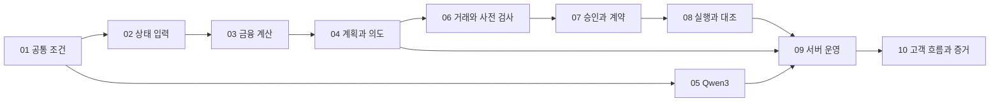

# TRON B × Furiosa A — 구현 계획 10 PR

2026-09-28. **10개 변경 단위의 구현 로드맵이며 실제 진행 상태는 아래에 기록한다.** 기준 설계는 [통합 웹서비스 아키텍처](TRON_FURIOSA_UNIFIED_ARCHITECTURE_20260928.md)다. 고객 소유 노드·SSH·runner 가입·노드 합의는 제외하고 **Qwen3 32B + 일반 웹서비스 + Economic Machine + 사용자 지갑 승인**을 구현한다.

기존 모듈을 지우고 새로 만드는 계획이 아니다. 기존 계산/검증 자산을 하나의 사용자 흐름으로 연결한다. 새 데이터셋·학습, NIC/FPGA 최적화, 외부 검증자 네트워크는 이 10개 PR의 범위 밖이다. ALPHA/VAULT/WATCH는 서버 안의 역할과 작업 기록이다.

**2026-09-29 진행:** PR 01–09는 순서대로 구현·검증해 [GitHub 저장소](https://github.com/skew-labs/gwdc2026)에 검토 가능한 PR로 올렸다. PR 10 [대화형 자산관리 workspace와 제출 증거](IMPLEMENTATION_PR10_20260929.md)도 구현했으며 Cherry 직접 연결 테스트 25개와 실제 브라우저·새로고침·모바일·콘솔 검증을 통과했다. exact commit 검증 증거는 `artifacts/pr10`에 포함한다. 실제 PostgreSQL server, Qwen/Kiln, 지갑 서명, 테스트넷 거래는 아직 검증하지 않았고 고객 서명·broadcast·배포·실자산 실행은 수행하지 않았다.

## 완료 기준과 공통 규칙

- 모든 PR은 변경 파일, 입력/출력 계약, 거절·복구 동작, 재생 가능한 검증 결과를 가진다. API mock만 통과한 것을 live integration으로 표시하지 않는다.
- 빌드·테스트·TVM 검증·부하 측정·실원천 조회는 Cherry `/srv/skew/gwdc-financial-agent-20260924`에서 수행한다. Mac은 편집·작은 읽기·원격 제어만 한다. 공유 서버의 다른 프로젝트를 수정하지 않는다.
- 경제 코어의 현재 기준선은 이번 재확인 **142개 통과**다. PR마다 영향 테스트를 우선하고, 경계 변경 시 관련 통합 검사를 포함한다. 의미 있는 실패 반례를 추가하며 구현을 그대로 따라 쓰는 줄 수용 테스트는 만들지 않는다.
- 원천 hash/서명/HTTP 성공/chain confirmed/상품 포지션 반영은 각각 다른 증거다. 미확인을 0이나 성공으로 바꾸지 않는다.
- 기존 미배포 금고에서 검증자 요구를 삭제해 새 흐름에 끼우지 않는다. 새 계약 버전과 실행 profile을 분리한다.
- 실제 고객 서명·체인 전송·계약 배포는 별도 승인 범위에 따른다. PR 구현/격리 검증은 계속 진행할 수 있으며, 라이브 증거가 없는 항목은 완료로 보고하지 않는다.
- 아래 신규 파일 경로는 제안 경로다. 구현 때 기존 모듈과 중복이면 해당 모듈을 확장하고 변경 이유를 기록한다.

## PR 목록과 의존성

| PR | 제목 | 이 PR에서 처음 가능해지는 것 | 선행 |
| --- | --- | --- | --- |
| 01 | `feat: unify confirmed mandates and service contracts` | 확인된 사용자 조건 하나가 모든 계산의 정본이 됨 | 없음 |
| 02 | `feat: bind TRON product and wallet observations to snapshots` | 실제 원천을 버전 있는 상품/지갑 상태로 읽음 | 01 |
| 03 | `feat: calculate TRON net yield liquidity and vault debt` | 금액·수익·자원·출구·부채를 같은 단위로 대조 | 01, 02 |
| 04 | `feat: compile comparable plans into policy-bound execution intents` | 두 적격 배분안과 원본 재생 가능한 실행 의도 | 01, 02, 03 |
| 05 | `feat: integrate Qwen3 32B intent compilation and usage traces` | 실제 AI 응답이 확인된 조건과 계획을 바꿈 | 01; 전체 trace는 04 |
| 06 | `feat: compile TRON transaction graphs and preflight checks` | 자산 조달부터 출금까지 unsigned 거래를 구성 | 02, 03, 04 |
| 07 | `feat: bind wallet approval and on-chain execution limits` | 승인 범위를 정확한 거래에 묶고 지원 경로를 계약으로 제한 | 01, 04, 06 |
| 08 | `feat: reconcile executions positions debt and performance` | 실행·부분 실패·실제 포지션·성과를 추적 | 02, 06, 07 |
| 09 | `feat: operate hosted monitoring and recoverable finance jobs` | 웹서비스 백엔드가 감시와 복구를 지속 수행 | 01, 04, 05, 08 |
| 10 | `feat: deliver chat workspace and dual-track demo evidence` | 대화→비교→승인→결과와 조건 변경 2회 데모 | 05, 07, 08, 09 |

05는 공통 조건 계약이 고정되면 02–04와 독립적으로 개발 가능하지만, 이 계획 자체가 병렬 에이전트 실행이나 별도 작업 생성을 요청하는 것은 아니다. 06–08은 앞선 타입/실패 의미를 고정한 뒤 연결한다.

## PR 01 — 확인된 Mandate와 서비스 정본

**문제:** `Need`, `InferenceScope`, `BasketPolicy`, sandbox가 다른 입력이며 기존 웹/API는 새 엔진을 호출하지 않는다. 제품이 어느 정책 버전을 실행하는지 하나로 설명할 수 없다.

**구현:** `MandateV1`, `ProductCapabilityV1`, trace ID, tenant/owner/wallet/network 컨텍스트를 정의한다. 금액·기간·즉시 현금·시간별 출금·가격 노출·차입 동의·부채 한도·단건/누적 금액·수수료·허용 동작을 원문 참조와 함께 보관한다. `DRAFT → CONFIRMED → SUPERSEDED/REVOKED`를 구현하고 확인되지 않은 초안으로 거래 의도를 만들지 못하게 한다. 서비스 조정 모듈은 순수 코어와 I/O 어댑터를 연결한다.

**대상:** 신규 `src/economic_machine/mandate.py`, `application.py`, 계약 fixture; 기존 `inference.py`, `basket.py`, `compiler.py`의 변환 경계. 신규 서비스 패키지 `src/finance_service/`의 인증된 컨텍스트 인터페이스와 repository interface. legacy `finagent` 쓰기 경로의 새 정본 연결 계획.

**통과 조건:** 같은 조건은 같은 정책 hash, 조건 변경은 새 revision; body의 다른 owner/네트워크 거부; 3,000 USDT와 30% 구별; 차입 미동의를 동의로 바꾸지 않음; 이전 unsigned 승인 무효화; 이미 미결 실행은 잠금 유지. 기존 v1/v2/v3 replay는 유지한다.

**증거/제외:** 정책 lifecycle·동시 수정·교차 tenant 반례. 아직 모델 호출·실거래는 없다. BYON 필드가 새 API/필수 설정에 생기면 merge 불가.

## PR 02 — 실제 상품·지갑 관측을 경제 상태로 연결

**문제:** 공개 수집 결과가 `finagent` DB에 있고 새 TRON planner는 호출자가 제공하는 입력을 받는다. 실제 잔액·부채·수수료 자원이 붙어 있지 않다.

**구현:** 원천별 원문/정규화/시간/오류를 보존하는 `SnapshotAssembler`를 만든다. 기존 `collect/normalize/store`를 재사용하고 `economic_machine`에 원본을 확인한 `StateDelta`를 공급한다. 상품 식별은 network+contract+protocol/version+action이다. V1/V2와 USDD/USDDOLD, 지분 자릿수와 underlying을 구분한다.

**범위:** JustLend USDT/USDD 시장·포지션·지분 교환비율·회수 가능량, sTRX 상태/출금 queue, USDD Vault 담보 유형·누적 부채/fee/청산/한도·소유권, native stake/delegation·Energy/Bandwidth·체인 비용 파라미터. USDD Earn은 별도 실행 경로가 입증되지 않으면 read-only/unsupported로 남긴다.

**대상:** `src/finagent/collect.py`, `normalize.py`, `store.py`; 신규 `src/economic_machine/tron_sources.py`, `tron_products.py`, `snapshot_assembly.py`; `config/tron_product_registry.json`, `tests/test_economic_tron_sources.py`.

**통과 조건:** 누락·오류·유효 0 구별; 공급 금리와 차입 금리 교환 공격 거부; decimals/계약/네트워크 불일치 거부; stale/future/서로 다른 블록의 의존 상태 유보; active/legacy 검사; API와 RPC 불일치를 표시. 같은 공급자의 API 두 개를 독립 oracle 둘로 세지 않는다.

**증거/제외:** Cherry에서 읽은 원문 hash·필드 대응·블록/시점이 포함된 read-only manifest. 사용자 지갑을 주지 않은 상태에서는 지갑 fixture만 쓰고 live position으로 표시하지 않는다. 연구 수집 타이머 재시작·새 학습 작업은 없다.

## PR 03 — 기간 순수익·유동성·Energy·Vault 부채 계산

**문제:** 현재는 선형 연율 proxy와 단일 출금 일수, 외부 입력 비용/스트레스다. 합성 APY 비교만으로 실행 가능한 수익을 계산할 수 없다.

**구현:** 상품별 연율 방식/기간 규칙, base yield와 reward의 구분, 보상 claim 가능성과 할인, 스테이킹·Energy 용량 보존, 네트워크/전환/진입/출구 비용을 계산한다. 즉시 현금과 시간별 회수 곡선을 나눈다. Vault는 담보+운용 자산−부채로 계산하고, accrued fee·USDD 가격·담보비율·스트레스·차입 동의를 묶는다. 현재 Vault `destination_apy_bps`의 독립 주장도 실제 목적지 snapshot/해시에 바인딩한다.

**대상:** 기존 `tron_yield.py`; 신규 `yield_math.py`, `liquidity.py`, `resource_cost.py`, `vault_accounting.py`; 독립 산식 벡터와 경계 테스트.

**통과 조건:** sTRX 집계 수익+Energy 이중 계산 거부; 임대한 Energy를 동시에 자기 거래 자원으로 쓰지 않음; 부채 증가를 이익으로 세지 않음; 목적지 금리가 바뀌면 Vault 기대수익도 바뀜; 차입 미허용이면 Vault는 비교 제외 이유 표시; 수수료를 더하면 예산을 넘는 후보 거부; TRX 가격 노출 없는 정책에서 TRX/sTRX/TRX 담보 제외. 양수/음수 금리·올림/내림·하루 미만 대기·청산 경계 반례 포함.

**증거/제외:** 사람이 별도 계산기로 재계산 가능한 금액/단위별 표. forward yield는 예측 가정으로 표시하며 시장 미래의 정답을 생성하지 않는다.

## PR 04 — 두 계획과 실행 의도를 같은 정책에 연결

**문제:** `tron_yield` 비교안과 generic signed basket 경로가 분리되어 있으며, 서로 다른 정책 조건이 복사될 수 있다.

**구현:** `PlanComparisonV1`을 Mandate와 snapshot에서 구성한다. 기존 grid/portfolio 계산을 재사용하고 보수안·성장안은 같은 하드 제약을 지키게 한다. Vault 비교는 후보 universe와 선택/제외 이유에 반드시 남긴다. 적격 두 안이 없으면 `NO_TWO_VIABLE_PLANS`와 조정 가능한 조건을 반환한다. 선택된 안을 원본부터 재생해 basket/경제 프로그램/실행 의도로 컴파일한다.

**대상:** `portfolio.py`, `grid_search.py`, `basket.py`, `authenticated_basket.py`, `tron_yield.py`; 신규 `plan_compiler.py`, `plan_service.py`; 관련 replay/조건 변경 테스트.

**통과 조건:** 30% 즉시 현금 조건에서 20% 현금 plan 거부; 가격베팅 금지에서 TRX>0 거부; 동일 상태+정책에서 동일 결과; snapshot/fee/부채/정책 revision 변조 시 commitment 거부; LLM 점수로 하드 한도 확대 불가; 검색 범위 초과 시 부분 탐색을 완전 최적이라고 보고하지 않음. 단일 상품+현금과 다중 상품 계획을 모두 다루며, 기존 2–8개 leg 제한을 사용자 계획 전체에 잘못 강제하지 않는다.

**증거/제외:** 같은 시장·다른 사용자 조건의 반사실 비교와 signed-source 재생. 결과는 `COMPARISON_READY`/`INTENT_PREPARED`이며 서명·거래가 아니다.

## PR 05 — Qwen3 32B 실제 연결과 추론 비용 경계

**문제:** API 호환 어댑터는 있지만 실제 모델 호출→확인 정책→계획 변화 증거가 없고, 조건 표현도 좁다.

**구현:** 고객 제공 endpoint가 아닌 서비스의 Kiln 설정에서 `qwen3-32b`를 확인한다. 실제 모델 ID/사용량/요청 ID를 기록하고 자연어→원문 근거가 있는 Mandate 초안→누락 질문→확인을 연결한다. strict JSON은 클라이언트에서 검증한다. 모델 응답의 thinking 내용 전체를 금융 증거로 저장하지 않으며 필요한 최종 구조·근거·usage만 보존한다. 허용 읽기 도구가 필요하면 함수/인자/횟수 예산을 코드에서 검사한다.

**추론 경계:** 정책/요청 hash 기반 캐시, 시간·토큰·재시도 상한, 비신뢰 문서 지시 차단, 설명은 확정된 수치와 출처에만 바인딩한다. `ModelOpinionV1` 플러그인 계약과 deterministic baseline을 추가하되 기존 FDC는 `SHADOW`로만 연결 가능하다. 모델의 confidence를 검증 확률로 바꾸지 않는다.

**대상:** `src/finagent/qwen.py`, `src/economic_machine/inference.py`; 신규 `src/finance_service/intent_service.py`, `model_provider.py`, `model_usage.py`; `contracts/model_binding.template.json`, 모델 응답/적합성 테스트.

**통과 조건:** 한국어 금액·기간·유동성·명시적 차입 허용 해석; 없는 숫자를 채우면 거부/질문; JSON 오류·429·timeout·지원하지 않는 모델에서 bounded failure; 모델 출력에 서명/전송 명령이 있어도 실행 없음. 동일 조건의 반복 감시는 모델 호출 0. 사용량 누락은 null이며 0토큰 성공으로 표시하지 않음.

**증거/제외:** 실제 Kiln 성공 trace와 두 조건의 서로 다른 계획, 흐름별 token/latency. 실제 endpoint 호출이 없으면 API mock은 통과해도 이 PR의 live acceptance는 미달로 남긴다. NPU energy는 제공 계측/명시적 추정/미측정을 구별한다. 새 모델 학습은 없다.

## PR 06 — 자금 조달이 빠지지 않는 거래 DAG와 preflight

**문제:** 기존 batch는 caller의 calldata를 묶을 뿐이며 한 입력 토큰과 원자적 결과 토큰 가정은 전체 TRON 상품을 표현하지 못한다.

**구현:** `ExecutionGraphV1`에서 balance reservation→필요 전환→approve→supply/stake/vault action→출금 요청→claim/repay를 실제 의존성으로 표현한다. 각 action에 ABI/token/recipient/금액/fee/TTL/simulation/postcondition 계약을 둔다. native TRX와 TRC20은 다른 인코딩을 쓴다. 프로토콜의 오류 반환값과 reverted transaction을 모두 검사한다.

**범위:** JustLend `mint/redeem/redeemUnderlying`, sTRX stake/unstake/claim, native stake/위임·해제·인출, USDD Vault open/담보 추가/mint/repay/담보 회수의 typed graph. USDT↔USDD 전환은 확인한 PSM/route의 quote/capacity가 있어야 한다. 미지원 capability는 unsigned graph에서도 실행 가능이라고 표시하지 않는다.

**대상:** 신규 `src/economic_machine/tx_graph.py`, `tron_actions.py`, `preflight.py`; `ProductCapabilityV1`와 `vault_batch.py` 호환 경계; 고정 ABI fixture·RPC replay 테스트.

**통과 조건:** 원문 예시의 USDD 1,000 부족을 탐지; 조달 견적이 있을 때만 전환 단계 생성; approve 성공/supply 실패·시장 유동성 감소·수수료 급등·지연 출금·USDD 부채 상환 부족을 구별; 이전 step의 예상 출력은 의존 step 확정 전 실제 잔액으로 취급하지 않음. 다중 거래 전체를 atomic으로 부르지 않음.

**증거/제외:** 단계별 자산 보존식, 사전/예상 사후 상태, quote·simulation manifest. 서명/전송은 이 PR에 없다. 단독 constant call 성공은 연속 거래의 사후 상태 검증 완료가 아니다.

## PR 07 — 사용자 승인과 계약의 실행 범위

**문제:** 현재 승인 API는 차단되어 있고 기존 금고는 다중 증명 구조와 별도 수탁 가정에 의존한다. 새 웹서비스에 이를 암묵적으로 적용할 수 없다.

**구현:** plan/graph/계정/network/단계/금액/fee/TTL에 묶인 `ApprovalV1`과 TronLink 서명 요청 계약을 만든다. 지갑 연결·조건 확인·계획 선택·거래 서명을 구별한다. 서명 payload 반환값을 독립적으로 디코딩해 원래 요청과 일치시킨다. 재로그인·계정/네트워크 변경·만료는 이전 unsigned 승인 카드를 무효화한다.

**계약:** 신규 `contracts/EconomicExecutionGuardV1.sol`과 제한된 JustLend 공급/회수 adapter. msg.sender 또는 명시적으로 검증한 사용자 권한, 고정 대상·함수·recipient·token, 단건/누적 한도, nonce/TTL, plan/step hash와 실제 입출력 검사를 둔다. 임의 delegatecall·임의 target·무제한 allowance를 만들지 않는다. Guard는 영구 수탁이나 검증자 네트워크를 요구하지 않는다. 기존 `EconomicCapitalVault`/registry의 증명 조건은 유지하고 새 product path에서 제외한다.

**대상:** 신규 `approval.py`, `signed_tx_validation.py`, 위 계약과 adapter; wallet bridge 인터페이스와 TVM 검증 스크립트. UI 표시는 PR 10에서 완성한다.

**통과 조건:** 서명 뒤 amount/target/fee/deadline/recipient 바꿔치기 거부; replay/다른 chain·wallet 거부; 재진입·악성 token·오류 반환·부족 output·잔액 잔류 반례; 호출이 성공했어도 실제 공급 지분이 없으면 성공 아님. 직접 지갑 경로와 Guard 경로의 enforcement scope가 응답에 구별된다.

**증거/제외:** 공식 TRON 컴파일러 manifest와 TVM 실행/호환 증거를 목표로 한다. 격리 EVM만 통과하면 TVM 항목은 남겨 둔다. 실제 고객 서명·배포는 별도 승인 전 수행하지 않는다. 허용되지 않은 adapter는 Guard 경로에서 활성화하지 않는다.

## PR 08 — 제출·확정·포지션·부채·성과 대조

**문제:** registry 소비 기록과 금융 실행 결과는 다르다. 현재는 실제 지분·부채·수익 확인까지 이어지지 않는다.

**구현:** 서명된 payload를 검증한 뒤 제출하고 txid·원본 hash·중복 방지 키를 기록한다. `SUBMISSION_UNKNOWN`에서 먼저 상태를 조회하고 동일 payload/txid 재처리만 명시적으로 허용한다. 재구성 거래는 새 승인 경로를 거친다. 확정/이벤트/실제 사용자 지분·잔액/부채를 모두 대조해 자본 잠금을 해제한다. 부분 완료·재조직·실패는 남은 graph를 중지하고 회복 가능한 상태로 기록한다.

**성과:** 예상 가정을 고정한 뒤 실제 이자·보상·평가손익·수수료·부채비용·외부 순입출금을 원장에 나눠 기록한다. Vault 상환은 부채 감소, redeem은 실제 underlying 증가, sTRX unstake는 queue와 claim으로 검증한다.

**대상:** `execution_evidence.py`, `runtime.py`, `tron_consumption_read.py`; 신규 `tron_execution.py`, `position_reconciliation.py`, `performance.py`; 프로토콜별 이벤트/포지션 verifier.

**통과 조건:** timeout 뒤 실제 성공한 거래 중복 제출 없음; approve만 성공한 상태를 예치로 표시하지 않음; 성공 코드지만 예상 지분 없음/다른 수취인/부채 미감소는 disputed; 재시작 뒤 서명·제출 불확실한 거래의 예약 유지; 입금을 수익으로 오인하지 않음; mainnet forecast와 Nile 실제 PnL 비교 혼합 거부.

**증거/제외:** 소액 테스트넷 실행이 승인된 경우 txid+같은 로그+전후 포지션 대조. 승인이 없거나 USDD Vault 테스트 배포가 없으면 replay fixture를 명시하고 실제 실행 증거는 미완으로 유지한다. 기록 전용 거래는 Furiosa의 blockchain 증거로 구별할 수 있으나 TRON 상품 예치 성공을 대체하지 않는다.

## PR 09 — 서버에서 지속되는 감시와 복구 가능한 작업

**문제:** 기존 runner는 독립 연구 정책과 파일/SQLite 경로를 사용한다. 여러 웹 사용자의 인증·예약·작업 복구를 처리하는 운영 백엔드가 없다.

**구현:** FastAPI 기반 API/인증된 wallet session과 PostgreSQL 저장소, transaction outbox/worker lease를 연결한다. 공용 시장 관측은 공유하고 개인 Mandate·지갑·승인·결과는 격리한다. 변경 의존성과 TTL/기한 이벤트를 큐에 넣고, 같은 계정의 충돌 실행은 직렬화한다. ALPHA/VAULT/WATCH 역할별 Job/Routine·활성/유보/실패 상태를 저장한다. 경제 계산의 DB/네트워크 의존성은 어댑터 밖으로 번지지 않게 한다.

**대상:** `src/finance_service/api.py`, `auth.py`, `repository.py`, `worker.py`, `scheduler.py`, DB migration; `deploy/economic-service.*`의 로컬 검증용 서비스 정의; 기존 `finagent.fs1_runner`의 재사용/대체 연결.

**통과 조건:** 다른 사용자의 plan/approval 조회·수정 차단; raw private key 요구 없음; 동시 job의 자본 이중 예약 차단; worker crash/lease 만료/restart 후 같은 intent 상태 복구; 관측값이 같아도 TTL 만료를 잡음; 무관 변경 0재계산; API 장애에서 무제한 모델/소스 재시도 없음; cooldown과 비용 문턱 없는 잦은 재배분 금지; 백업→복원→journal 검증.

**증거/제외:** Cherry 격리 서비스에서 장애 주입·다중 세션·복구 로그. endpoint 비밀값과 사용자 입력은 적절히 가려 보관한다. 고객 노드 등록·SSH/API 키 입력 화면·노드 상태는 만들지 않는다. 운영 배포 위치/공개 주소 결정은 개발 서비스 실행과 별개다. Codex 예약작업을 생성하지 않는다.

## PR 10 — 대화형 고객 흐름과 두 트랙 제출 증거

**문제:** 현재 화면은 이전 읽기용 planner에 연결되어 있고 새 금융 코어·승인·포지션·성과를 보여주지 못한다.

**구현:** 기존 `web/`를 대화 중심의 ALPHA/VAULT/WATCH workspace로 연결한다. 사용자가 앞서 지정한 Fomo token·WHOLLET workspace의 대화→상품 작업 창→구체적 승인 흐름을 기준으로 삼는다. 자연어 입력 뒤 상품 검색/출처/시점과 두 계획 패널이 열리고 사용자는 금액·기간·유동성·차입 여부를 확인한다. 계획마다 순수익 가정·비용·출구·노출·Vault 포함/제외 이유를 표시한다. 정확한 승인 카드→TronLink→단계별 상태→보유/성과로 이어진다. 새 정책 변경은 이전 카드에 명확히 표시한다. 노드 설정·SSH/API 키 등록 화면은 없다.

**효율성·두 번 실행:** 같은 snapshot을 고정한 run A/B에서 Qwen의 사용자 조건 변화가 계획·거래에 영향을 주는 것을 검증한다. 실제 테스트넷 action과 matching receipt/history, 제한 위반 거부 사례, 흐름별 토큰·지연·계산 횟수·energy 측정 범위/미측정을 증거 패널로 제공한다. 네트워크와 replay/simulation/live 표시는 사용자가 오인할 수 없게 한다.

**대상:** `web/index.html`, `web/app.js`, `web/app.css`, 서비스 API 연결, 브라우저 end-to-end 검사; 신규 `docs/submission/requirements.md`, `evidence-manifest.json`, 사용자 안내·재현 절차.

**통과 조건:** 대화부터 결과/재조회까지 새로고침과 세션 재연결 뒤 유지; 일시정지된 감시를 활성으로 표시하지 않음; 두 적격안이 없는 경우 이유와 수정 경로; 지갑 reject/계정 변경/quote 만료/부분 완료/복구 UX; 사용량 null을 0으로 표시하지 않음; 브라우저에서 다른 tenant 근거 접근 불가. 중복 주문·정책 위반·잘못된 포지션 성공 표시 0건을 요구한다.

**증거/제외:** TRON B 요구와 Furiosa A 요구 각각에 artifact/hash/txid/trace를 연결한다. 모의 성과는 허용된 review 데모로 별도 표시한다. 실제 Kiln 호출·필수 blockchain trace가 없거나 USDD 필수 기능의 실행 가능성이 확인되지 않으면 두 트랙 전체 합격을 선언하지 않는다. 줄 수와 APY 예시를 성능 증거로 쓰지 않는다.

## 외부 의존성과 진행 방식

| 확인할 항목 | 지금 확인된 범위 | 영향 PR / 처리 |
| --- | --- | --- |
| Kiln Qwen3 32B | 공개 목록에 `qwen3-32b` available; 사용자 모델 결정 확정. 계정별 실제 호출 미확인 | 05, 10. 코드/fixture 먼저 완성하고 지정 환경 실제 응답을 붙임 |
| TRON/JustLend 상태·주소 | 공식 read API와 mainnet/Nile 주소 문서 존재 | 02, 06. 주소 존재와 현재 유동성·실행 성공을 분리 |
| USDD Vault 테스트 실행 | mainnet 공식 구조 확인; 사용할 테스트 배포 미확보 | 06–08, 10. typed adapter/격리 검증을 만들고 live evidence 미완 표시. mainnet 사용으로 자동 우회 금지 |
| 사용자 지갑·테스트 자금·서명 | 이번 요청은 설계/개발 권한이며 실제 서명 지시는 없음 | 07–08, 10. 검토 가능한 정확한 graph와 금액/비용을 먼저 완성 |
| TVM 실행 환경 | 기존 증거는 TRON 컴파일+격리 EVM, 실제 TVM 실행 테스트 미확인 | 07. 현재 증거 범위를 유지하고 호환성 차이를 검사 |
| 운영 배포 환경 | Cherry는 개발/테스트에 승인된 장소 | 09–10. 외부 서비스 배포 완료와 구별 |

하나의 외부 값이 없더라도 그 값에 의존하지 않는 타입·실패 의미·격리 검증·다음 PR 준비는 진행한다. 승인이나 실제 증거가 필요한 경계를 시간 경과 또는 테스트 통과로 대신하지 않는다.

## 도달 지점

1. **PR 01–05:** 실제 원천과 실제 AI 조건 해석을 검증 가능한 두 계획으로 연결한다. 아직 거래 완료 제품은 아니다.
2. **PR 06–08:** 정확한 unsigned 거래부터 사용자 승인·실행·결과·성과를 연결한다. 지원/검증된 상품·네트워크만 실행한다.
3. **PR 09–10:** 지속 운영되는 대화형 웹서비스와 두 트랙 재현 증거를 완성한다. 기관 운용을 위한 외부 감사·장기간 장애/성과 검증은 별도다.

각 merge는 이 지점에 도달했다는 실제 증거와 남은 제한을 보고한다. 계획서를 쓴 것, 소스를 만든 것, mock을 통과한 것, 실제 자산이 반영된 것은 각각 별개다.

## PR 11 — PostgreSQL 16 운영 상태 고정

초기 10개 PR 이후 첫 운영 hardening 단계다. PR09의 SQLite 기준 저장소를 실제 PostgreSQL 16 adapter로 대체 가능한 상태로 만들고, PR10 workspace가 쓰는 API entrypoint에 연결한다. API와 worker DSN을 분리하고 API 프로세스에 worker 자격증명이 들어오면 시작을 거부한다. RLS로 tenant/owner/wallet/network scope를 강제하며 작업 claim, 만료 lease 복구, routine scheduling, 공용 observation 갱신은 별도 worker 역할만 수행한다.

상태와 hash-chain journal은 같은 transaction으로 갱신한다. migration은 파일 hash ledger와 advisory lock으로 적용하고 이미 적용한 파일의 drift를 거부한다. Cherry의 격리 PostgreSQL 16.15에서 비관리자 API/worker 역할, 동시 `SKIP LOCKED` claim, 동일 계정 직렬화, journal 변조 차단, 서비스 프로세스 재시작 뒤 레코드·작업 지속성을 실제로 검증한다.

이 단계도 production 배포 완료가 아니다. 전역 journal lock과 전체 chain 검증은 대규모 write 경로의 병목이며, connection pool, secret rotation, TLS, managed backup/PITR, restore·failover·load/soak 검증이 남아 있다. 논리 snapshot은 WAL/PITR 백업으로 부르지 않는다. 고객 서명·broadcast·deploy·자산 이동은 계속 0건이다.
