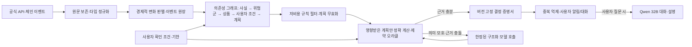

> Historical record. Current product, setup and verified scope: [faat README](../../README.md).

# 금융 에이전트 엔진: 변화만 계산하는 상시 판단 런타임

> 2026-09-28 갱신: 아래 증분 판단 원리는 재사용하되 고객 소유 노드 배치는 제외한다. 현재 제품 기준은 [Qwen3 32B 통합 웹서비스](TRON_FURIOSA_UNIFIED_ARCHITECTURE_20260928.md)다. 아래 구현 상태·가동 기록은 작성 당시의 기록이다.

2026-09-25. 이 문서는 기존 `FINANCIAL_MODEL_ARCHITECTURE_20260923.md`의 모델 연구와 별개인 **증분 판단 원리**다. 제품/대회의 우선 명세는 [사용자 소유 노드 기반 FS1 BYON 설계](FS1_NODE_GWDC_ARCHITECTURE_20260925.md)다. Jev의 내부 구조를 재현하거나 자체 범용 AI를 만드는 계획이 아니다. 목표는 고객의 자기 노드에서 금융 에이전트가 계속 일하면서도 변화가 없을 때 모델 호출과 사용자별 전체 재계산을 하지 않는 것이다. 현재 Cherry에서 가동 중인 것은 원천 수집·연구 사례 생산이며, 아래 사용자별 판단 런타임은 아직 구현되지 않았다.

## 문제와 판단 기준

현재처럼 10분마다 원천을 수집하는 일은 관측을 축적한다. 모든 수집본마다 모든 사용자에게 Qwen·FDC·오라클을 다시 실행하면 호출 비용, 지연, 잘못된 알림이 사용자 수와 함께 늘어난다. 반대로 모델을 호출하지 않는다는 이유만으로 에이전트가 작동하는 것도 아니다. **어떤 금융 상태의 변화가 누구의 어떤 확정 조건과 계획을 무효화하는지** 계산하고 기록해야 한다.

엔진의 핵심 불변식은 다음과 같다.

1. 경제적 값·품질·근거가 변하지 않은 수집본은 사용자 계획 재계산과 모델 호출을 **0회** 발생시킨다. 원문 해시만 달라진 경우에도 원인과 변경 범위를 먼저 판별한다.
2. 한 사실이 바뀌면 해당 사실·상품·공통 위험에 의존하는 확정 사용자 조건과 계획만 재평가한다. 사용자 수 전체에 비례하는 주기 스캔을 기본 경로로 두지 않는다.
3. 명확한 단위·예산·출금 시점·한도·금리 변화는 타입 검사와 결정적 계산으로 처리한다. 모델은 모호한 문장·새 문서 의미·충돌 근거·설명처럼 비정형 판단이 필요한 경우에만 호출한다.
4. 오라클의 계산 증명, 근거의 사실성, 사용자에게 적합한 최적 배분, 거래 가능성은 서로 다른 결과다. 누락된 비용·출금 약관·유동성·권한이 있으면 최적 배분이나 구매 가능을 선언하지 않는다.
5. 각 결정은 입력 상태 버전, 규칙 버전, 원문 근거, 실행 시간, 계산 결과를 함께 보존한다. 새로운 원천/사용자 조건/규칙 버전은 이전 계획과 승인 후보를 무효화한다.

## 런타임 경로

**관측층.** 기존 `collector_loop.py`와 `auto_cases.py`는 원문·시각·단위·변경 사실을 만드는 출발점이다. 커넥터는 `FactChanged` 또는 `SourceQualityChanged`를 `(source, subject, metric, old/new canonical value, quality, event_time, observed_at, raw witness, source version)`으로 발행한다. 가격 또는 유동성처럼 빠른 상태는 가능한 체인 이벤트/제공자 스트림을 우선 사용하고, 정기 스냅샷으로 누락을 복구한다. 현재의 10분 폴링만으로 실시간 감시를 주장하지 않는다.

**의존성층.** 사용자 발화를 매번 재해석하지 않고, 확인된 조건을 `MandateVersion`으로 컴파일한다. 금액·자산·단위·시점·즉시 필요액·금지 상품·위험 상한·허용 행동과 근거가 각각 필드다. `fact_key → product/risk_group → mandate_id → plan_id` 역색인으로 영향을 받는 계획만 찾는다. 공통 담보·토큰·프로토콜의 노출은 같은 위험군으로 연결한다. 등록·정정·철회는 원자적으로 색인을 갱신한다.

**판단층.** 변화의 영향이 없는 조건은 즉시 종료한다. 영향을 받은 계획은 타입 검사, 원천 최신성, 현금·예산·위험·출금 제약, 명시된 목적함수의 최적화 순서로 검사한다. 최적화는 완전한 목적함수와 비용·제약이 있을 때만 `FORMAL_OPTIMUM` 범위의 증명을 만든다. 현재의 `formal_optima.py`는 제한된 총수익 대리목표에 대한 연구 계산이고 `allocation_oracle.py`는 제안 제약 검사기다. 둘을 소비자용 최적 배분 증명서로 승격하지 않는다.

**모델층.** Qwen 32B는 첫 발화/조건 수정 해석, 새로운 비정형 근거 요약, 사용자 요청 설명에 쓴다. 입력은 최신 대화 전문이 아니라 필요한 `MandateVersion`과 근거 조각만 전달한다. 모호한 고빈도 이벤트는 상품·시간창별로 합치고, 좁은 타입 출력·확률·유보를 가진 작은 결정 모델을 **측정 후에만** 추가한다. 자체 FDC 연구가 엔진의 선행 조건은 아니다. 사용자가 말하지 않은 조건, 비용, 출금권은 모델이 채우지 않는다.

**전달층.** `DecisionCertificate`는 `mandate_version`, `fact_release`, `rule_version`, `candidate_set`, `result`, `reason_codes`, `evidence_witnesses`, `expires_at`을 포함한다. 동일 상태의 중복 알림을 억제하고, 실질적으로 선택이 달라질 때만 ALPHA가 알린다. 사용자 승인·지갑 서명·체결 영수증은 각각 별도 단계다. 현재 구현에 구매 경로가 없다는 사실은 그대로 유지한다.

## 실행 제어와 실패 의미

- 큐 키는 `(mandate_id, fact_release, rule_version)`으로 멱등 처리한다. 같은 원천 변화가 여러 경로로 들어와도 한 계획은 한 번만 재평가한다.
- 짧은 시간의 연속 금리·가격 변화는 합치되 원천 변경 이력은 모두 보존한다. 기한 임박, 출금 불능, 계약 상태 변경은 합치기 대기에서 제외한다.
- 큐 지연·429·원천 충돌·오라클 실패·모델 실패는 `STALE`, `NEEDS_EVIDENCE`, `FAILED` 등 명시 상태로 남긴다. 마지막 성공 계획을 최신 계획처럼 재사용하지 않는다.
- 오라클과 모델 예산을 상품·사용자·시간창별로 제한한다. 예산 소진 때 결정적 필터와 차단 상태는 계속 작동하고, 모호한 판단은 유보한다.
- 새 규칙이나 의존성 그래프 버전은 모든 관련 계획의 무효화 이벤트를 만든다. 이 경우 전체 재계산은 의도된 일회성 작업이며 배치·속도 제한을 적용한다.

## 데이터 생산과 판정 품질

상시 감시의 산출물은 단순 스냅샷 수가 아니라 `(변화 → 영향받은 조건 → 계산 → 증거 → 실제 결과)` 연결이다. 공식 원천의 새 관측과 기존 `FORMAL_OPTIMUM`은 각각 별도 범위로 저장한다. 출금 약관·실제 비용·가격 영향·체결/출금 결과가 없는 계획은 소비자용 최적 배분 정답이 아니다. 고품질 라벨 엔진은 원천 검증, 독립 계산, 시점 봉인, 사후 결과 대조, 오류 격리를 결합해야 한다. 이것은 현재 미구현이며 모델 출력의 자기 승인으로 대체하지 않는다.

## 현 구현과 남은 작업

| 층 | 현 상태 | 다음에 구현할 최소 단위 |
| --- | --- | --- |
| 원천 수집·변화 사례 | Cherry의 10분 수집, 시간당 사실/변화 사례와 형식 최적화 가동 | 이벤트 원장에 품질·경제적 변화와 원문 해시를 분리해 기록 |
| 사용자 조건 | 대화 입력 계약과 읽기용 계획 화면만 있음 | 확인된 조건 버전과 수정·철회 이력 저장 |
| 영향 범위 | `auto_cases.py`가 원천 변화를 채굴하지만 사용자 계획과 연결하지 않음 | 사실→위험군→조건→계획 역색인과 증분 무효화 |
| 결정 오라클 | CLI/연구 검사기, 서비스 판단 경로에는 없음 | 영향받은 계획에 한해 정확 계산·근거 증명서 발급 |
| 모델 호출 | Qwen 어댑터는 요청 시 해석; FDC는 연구용 | 모호성 라우터·호출 예산·동일 상태 캐시·호출 전후 계측 |
| 자율 에이전트 | ALPHA·VAULT·WATCH는 설계, 개인 루틴 미구현 | 버전 있는 작업·기한·알림과 복구 가능한 큐 |

첫 세로 관통 구현은 **한 상품의 실제 상태 변화가 등록된 테스트 조건 중 어느 계획을 무효화하는지** 증명하고, 변화 없는 수집본에서 계획 재계산·모델 호출이 0회인 것을 보이는 것이다. 그다음 공통 위험군, 조건 변경, 출금 기한, 대량 사용자 역색인, 모델 예외 경로를 붙인다. 사용자의 실계좌나 거래 권한은 이 검증에 필요하지 않다.

## 합격 실험

같은 원천 재생 로그와 동일한 사용자 조건 집합으로 `모든 사용자에게 주기적 Qwen+오라클 실행`을 기준선으로 둔다. 100명 → 1만명 → 10만명 조건을 늘려 변화 없음·한 상품 변화·공통 위험군 변화·원천 실패·사용자 조건 수정·규칙 갱신을 재생한다. 각 실험은 놓친 영향 계획 수, 잘못된 알림 수, 원천 변화부터 계획 무효화까지 p50/p95, 처리량, 사용자당·유의미한 변경당 모델 호출/입출력 토큰, 전체 비용, 큐 최대 지연과 복구 시간을 측정한다. 에너지는 실제 계측 범위를 제시할 수 있을 때만 수치화한다. **동일 결과 품질에서 시간·비용이 개선**되어야 엔진 가속을 주장할 수 있다.

Jev의 공개 설명에서 참고할 것은 소프트웨어가 바로 쓰는 좁은 타입 결정과 불확실성 출력, 병렬 처리라는 방향이다. Jev의 공개 속도 수치는 해당 제공자의 비교이며 우리 시스템 성능 증거가 아니다. 우리 차별점은 금융 상태·사용자 조건·근거의 **증분 의존성 계산**과 정확한 금융 제약 증명이어야 한다.

참고: [TypeSafe의 Jev 공개 설명](https://typesafe.ai/blog/introducing-system-one-models-and-jev).
