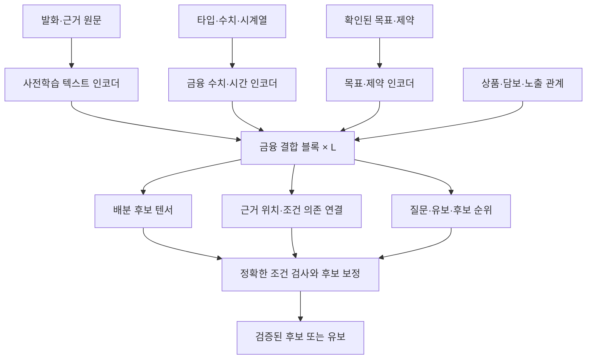

> Historical record. Current product, setup and verified scope: [faat README](../../README.md).

# 금융 전용 모델 아키텍처 연구·구축 명세

2026-09-23 · 연구 제안 v0.1 · 당시의 모델 연구 가설. 2026-09-25 사용자 정정에 따라 제품의 우선 아키텍처는 [금융 에이전트 엔진](FINANCIAL_AGENT_ENGINE_ARCHITECTURE_20260925.md)으로 전환했다. 자체 모델은 엔진의 필수 전제나 현재 제품 목표가 아니다.

아래 내용은 이미 수행한 모델 연구와 당시 가설의 기록이며 제품 구현 우선순위를 정하지 않는다. 기존 데이터 원천·금액 계산·승인·UI 계약은 유지한다. [신경망 소스](../../research/fdc/model.py)와 에피소드 V2 검증·특징 변환·합성 사례 학습 경로를 Cherry CPU에서 실행했다. 문자 해시 기준선과 고정 다국어 E5-small 인코더를 별도로 평가했다. 합성 홀드아웃 제약 위반과 비중 오차의 상충관계를 관찰했으며 실제 금융 성능은 검증되지 않았다. 독립 골드셋·확률 보정·NPU 이식은 미구현이다. [구현 상태](../../research/README.md)를 따른다.

2026-09-24 최신 범위는 사용자가 지정한 **금융 입력부·공동 판단부·계획 출력부·조건 변경 학습**이다. 타입을 분리한 데이터셋 V3와 전체 출력 쌍 손실까지 구현·학습했다. [네 구성요소와 실험 결과](../../research/FINANCIAL_CORE_V3.md)를 현재 검증 기록으로 사용한다. 실제 자료로 학습된 골드 모델이라는 주장은 하지 않는다.

## 1. 만들 수 있는 것과 입증할 것

우리 데이터 표현, 학습 가능한 신경망 연결, 출력 구조, 학습 목적함수, 추론 경로를 설계하고 가중치를 학습하는 금융 전용 모델을 만든다. 기존 사전학습 언어 인코더를 활용하더라도 나머지 금융 상태·관계·판단 모듈을 직접 설계·학습할 수 있다. 언어 이해 자체를 처음부터 사전학습하는 거대 프로젝트를 필수 전제로 두지 않는다.

목표는 금융 업무에서 품질·처리시간·비용의 경쟁력이다. JEV와 동급 또는 그 이상이라는 평가는 비교 실험 결과가 있어야 한다. 현재 그런 성능은 입증되지 않았다. 공개 JEV 소개에서 새로운 구조·병렬 샘플링·RLCD라는 방향은 확인했지만, 이번에 읽은 자료만으로 전체 내부 학습 레시피를 재현할 수는 없다. [J1]

**독자성이 생기는 곳:** 시간·단위·근거가 있는 금융 상태 표현, 상품 간 노출과 사용자 제약을 함께 처리하는 학습 모듈, 조건 변경에 대한 일관성 학습, 실행 가능한 후보와 유보를 함께 출력하는 구조. 각각은 기존 연구와 비교하고 제거 실험으로 가치를 증명한다. 알려진 기법의 조합을 새 이름으로 부른 것만으로 연구적 신규성을 주장하지 않는다.

## 2. 풀 문제를 정확히 정의한다

입력은 시점 t까지 확인된 사용자 요구, 자산/포지션, 후보 상품, 약관 근거, 비용/유동성 관측이다. 출력은 다음 중 하나다.

- 사용자에게 추가로 확인할 **질문 대상 필드**.
- 근거 부족·모순·미확인 경로 때문에 판단을 보류할 **이유와 부족한 자료**.
- 비교할 **배분 후보 묶음**, 후보별 근거 위치와 조건 의존 관계.

모델은 미래 실제 수익률을 이미 아는 것처럼 최적 투자를 선택하지 않는다. “좋은 계획”은 사용자에게 확인된 목적·제약과 당시 이용 가능한 정보에 대한 것이다. 실행 권한·확정 거래 상태는 실제 기록으로 판단한다.

예: “2,000 USDT 중 500은 바로 쓸 수 있어야 하고 나머지는 한 달.”

모델은 높은 APY 상품 하나를 분류하는 대신, 현금 수요 시점과 각 상품의 출금 조건, 토큰 전환 비용, 같은 위험에 대한 중복 노출을 공동으로 처리한다. 사용자가 500을 1,200으로 바꾸면 관련 제약과 후보 전체가 같이 바뀌어야 한다. 최종 금액·비용·권한은 정확한 계산과 실행 검사로 확인한다.

## 3. 입력 표현부터 금융에 맞춘다

| 입력 채널 | 모델이 받는 표현 | 보존할 원본 |
|---|---|---|
| 사용자 목적 | 발화 임베딩, 확인된 조건, 필요한 현금과 날짜, 허용 자산/행위 | 발화와 확인 버전 |
| 상품·자산 | 상품/체인/계약 ID, 관계, 알려진 참여·출구 규칙 | 공식 문서와 계약 식별자 |
| 수치 관측 | 지표 타입·단위·통화, 스케일을 정규화한 값, 결측 상태 | 원시 정수/Decimal 문자열 |
| 시간 | 관측 시점, 경과 시간, 효력 기간, 과거 시계열의 시간 간격 | 타임스탬프·블록·수집 이력 |
| 근거 | 짧은 원문 구간과 ID, 관측/문서 유형, 출처·충돌 상태 | 원문 해시와 위치 |
| 관계 | 동일 기초자산·담보·프로토콜·보상·출금 경로 등의 연결 | 관계의 출처·유효기간 |

수치용 학습 특징은 근사 표현이며 정확한 계산 값과 분리한다. 4%, 0.04, 400bp가 같은 지표로 정규화됐을 때 모델 표현이 일치해야 한다. 서로 다른 통화·금리 종류는 같은 숫자라도 다른 타입이다. 0/누락/만료/오류는 별도 상태다.

상품 나열 순서가 달라져도 전체 판단은 같고 상품별 결과는 해당 상품을 따라 움직여야 한다. 상품 축에는 순열 등변성을, 시간 축에는 인과 순서를 적용한다. 입력에서 미래 관측을 가리는 것으로 끝내지 않고 정규화 통계·특징 생성도 학습 기간 안에서만 계산한다.

## 4. 제안 신경망: 금융 상태를 공동으로 처리하는 코어

작업명은 기존 FDC를 유지한다. 다음은 API 호출 단계를 그린 것이 아니라 **학습 가능한 모듈의 데이터 흐름**이다.



### 4.1 금융 결합 블록

상품 i의 과거 관측을 인과 시간 인코더가 요약하고, 상품 토큰은 해당 근거 문단에 cross-attention한다. 상품 간 attention에는 검증된 관계 유형을 bias로 추가한다. 사용자 제약 토큰은 여러 상품을 읽어 현금·기간·노출 요구를 표현하고, 상품 토큰은 다시 제약 토큰을 읽는다. 이 결합을 고정 깊이 L로 반복한다.

상품별 독립 점수만으로 합산하지 않는다. 한 상품의 배분이 다른 상품의 예산·노출·유동성 여지를 바꾸기 때문이다. 여러 출력 헤드는 같은 결합 상태를 사용하지만 독립성이 보장된다고 주장하지 않는다. 관계를 넣는 것의 이득도 표형 MLP나 단순 집합 인코더보다 좋은지 확인한다.

사전학습 텍스트 인코더는 원문 의미를 읽는 부품이며 체크포인트·라이선스·한국어 품질을 비교해 고른다. Qwen 32B API만으로는 내부 hidden state나 새 가중치 학습을 사용할 수 있다고 가정하지 않는다. 처음에는 별도의 공개 인코더를 고정하고 금융 모듈을 학습하며, 필요할 때 일부 언어층을 해제한다.

### 4.2 병렬 후보 출력

K개의 계획 슬롯을 두고 각 슬롯이 N개 상품과 현금 보유에 대한 배분 점수, 행위 유형과 참조를 동시에 출력한다. 텍스트로 금액을 한 자리씩 생성하지 않는다. 후보의 초기 금액은 예산과 점수를 이용해 계산하고, 정밀도·잔액·비용·출금·허용 행위를 코드에서 검사한다.

연속 금액 제약이 선형/볼록인 최소 실험에서는 projection 또는 작은 최적화 문제로 후보를 보정할 수 있다. 거래 고정 비용, 최소 거래액, 여러 단계 전환 등 비볼록 조건은 일반 projection만으로 해결된다고 하지 않는다. 초기에는 허용된 경로 템플릿을 열거해 각각 검증한다. 불가능한 후보를 버리고 남는 안이 없으면 유보한다.

보정 전 위반률, 보정량, 보정 후 위반률을 모두 기록한다. 강력한 계산기가 잘못된 모델 출력을 매번 고쳐도 모델 성능이 좋은 것처럼 보이지 않게 한다. 여러 계획은 수치만 약간 다른 중복안이 아니라 유동성·비용·노출의 실질적 차이를 가져야 한다. 두 안을 반드시 생성하도록 강제하지 않는다.

### 4.3 근거·질문·유보 출력

근거 헤드는 입력에 있는 문단/사실 ID와 구간을 선택한다. 조건 의존 헤드는 어느 사용자 조건과 근거가 어느 후보 결정에 관련되는지 연결한다. 이 연결은 모델의 예측이며 attention 값이나 선택된 출처 자체를 사실 증명으로 취급하지 않는다. 별도 원문 지지 판정과 반사실 검사를 통과해야 한다.

질문 헤드는 부족한 조건 필드를 고른다. 유보 헤드는 예측과 함께 학습하되, 모두 유보하는 해법을 막도록 coverage를 제약한다. 분포 밖의 새 프로토콜·충돌 근거·정보 부족은 별도 평가한다. 모델의 유보 예측과 무관하게 코드의 필수 증거/승인 조건은 반드시 충족해야 한다.

## 5. 구체적인 첫 실험 크기

확정 사양이나 성능 예측이 아닌 **착수 설정**이다.

- 상품 슬롯 N≤32, 시점 T≤64, 근거 문단 E≤64, 사용자 제약 C≤16.
- 공통 은닉 차원 d=256, 금융 결합 블록 L=4, attention head 8, 계획 슬롯 K=4.
- 과거 관측 요약은 짧은 causal encoder로 시작한다. 장기 예측 모듈은 실제 역사 데이터가 충분할 때 별도 실험한다.
- 첫 학습은 고정 텍스트 인코더 + 금융 모듈. 전체 모델 크기와 메모리·처리량은 인코더 선정 및 구현 후 산출한다.
- NPU 이식은 지원 연산·정밀도·동적 shape·컴파일 경로를 확인한 뒤 한다. Qwen API 사용과 우리 모델의 NPU 실행을 같은 것으로 보고하지 않는다.

첫 버전은 **단일 시점의 무차입 배분 제안과 필요한 질문**에 집중한다. 자율 매매, 장기 가격 예측, 여러 체인 실행, 강화학습까지 동시에 넣지 않는다. 연구 목표는 유지하되 한 번의 실험으로 원인을 파악할 수 있는 범위를 택한다.

## 6. 학습 목적은 금융 판단의 오류에 맞춘다

초기 loss 후보:

`L = λ1·L_condition + λ2·L_evidence + λ3·L_plan + λ4·L_counterfactual + λ5·L_selective`

| 항 | 무엇을 학습하나 | 정답/계산 방식 |
|---|---|---|
| condition | 조건·누락·질문 필드 | 사람 검토한 발화-필드 연결 |
| evidence | 주장에 필요한 근거 선택과 충돌 | 사람 검토한 구간·지지/반대/부족 라벨 |
| plan | 실행 가능한 후보의 상대적 품질 | 확인된 목적함수·현재 가정 안의 독립 계산/열거 |
| counterfactual | 조건 하나 변경에 맞는 출력 변화 | 기준/변경 상태 쌍과 유지·변경되어야 할 성질 |
| selective | 답변과 유보의 오류/coverage 균형 | 검토 라벨, 보정셋, 별도 분포 변화 평가 |

plan loss는 단 하나의 정답 비중을 복사하는 방식으로 시작하지 않는다. 동등하게 가능한 안, 조건상 열등한 안, 불가능한 안을 구분한다. regret를 쓸 때 기준은 **같은 입력·동일 비용 가정·확인된 목적함수 아래 계산한 해**다. 미래 실현 수익을 미리 아는 해를 기준으로 정답을 만들지 않는다.

사용자 효용 가중치는 마음대로 정하지 않는다. 유동성 우선/비용 우선 등 사용자가 확인한 우선순위나 명시적인 비교 목적별로 학습한다. 결과 분포를 예측하는 후속 모델은 별도 역사 데이터와 scoring rule 검증을 갖춰야 한다.

처음부터 새로운 RL 알고리즘을 발명했다고 부르지 않는다. 지도학습과 후보 순위 학습으로 모듈을 검증하고, 필요할 때 decision-focused 학습이나 시뮬레이터 기반 개선을 추가한다. 시뮬레이터 보상 편향과 학습 환경 과적합은 독립적으로 검사한다.

## 7. 데이터셋 계획을 모델 학습 수준으로 확장

기존 16개 합성 라벨은 포맷 확인용, 120~300개는 평가 착수용이다. 독자 모델 학습에 충분하다고 주장하지 않는다.

학습 단위 `FinancialDecisionEpisodeV2`:

```text
as_of + source_release + scenario_family + scenario_generator_version
user: utterance + confirmed_goals + horizon + cash_needs + allowed_actions
state: assets + positions + typed_metrics + historical_observations
relations: protocol/token/collateral/reward/exit edges + evidence references
constraints: versioned rules + known/unknown + referenced evidence
candidate_set: actions + allocation + costs + viability + calculation_trace
targets: condition spans + evidence links + acceptable plan ordering + abstention
counterfactual: parent + changed_field + expected_change + preserved_properties
provenance: real/document/synthetic + rights + reviewers + split
```

선행 수집은 기존 정형 데이터 계획을 따른다. 추가할 것은 **계획 후보·제약·조건 변경 쌍·근거 연결**이다. 데이터셋 목표 크기는 아래의 학습 곡선에서 효용을 확인하며 조정한다.

| 묶음 | 초기 목표 범위 | 만드는 방법과 제한 |
|---|---|---|
| 언어·근거 검토 사례 | 500~2,000 에피소드 | 실제 공식 문서와 작성 발화, 사람 검토. 실제 사용자 발화 여부 표시 |
| 수치·제약 학습 상태 | 10,000~50,000 파생 상태 | 검증된 규칙으로 예산·기간·비용·유동성·노출을 변화. 대부분 합성임을 표시 |
| 독립 평가 | 최초 300, 확대 1,000 목표 | 원문/시점/프로토콜/시나리오 가족 분리. 학습 정답이나 생성기 한 종류에 종속되지 않음 |

수량은 확보 실적이나 학습 성공의 보장이 아니다. 1k→5k→20k 학습 곡선을 먼저 본다. 작은 학습셋에서조차 데이터 의미를 못 배우면 행 수만 늘리지 않는다. 정답은 운영 엔진 복사만으로 만들지 않고 작은 문제의 독립 열거·별도 계산·사람 검토로 교차 확인한다.

조건 변경 학습에는 조건을 바꿔도 같은 결론이 맞는 경우도 필요하다. 변화만 강제하면 불필요한 거래를 배우게 된다. 단위 표현 변경·상품 순서 변경은 불변성 평가, 금액 증가에 따른 고정 수수료 비중 변화는 조건부 변화 평가로 분리한다. 단조성을 보장할 수 없는 상황에 임의의 단조 loss를 걸지 않는다.

역사 기반 데이터의 미래 결과는 평가 대상/학습 target일 수 있어도 당시 입력에는 들어갈 수 없다. 사용자 승인 결과는 적합한 계획의 정답도 아니고 수익성 증거도 아니다.

## 8. Qwen 32B와 자체 모델의 역할

Qwen 32B는 대회 지정 모델로서 자연어 대화, 복잡한 표현의 해석, 검증된 결과 설명에 실제 사용한다. 조건 후보는 사용자 확인과 코드 검증을 거친다. 자체 FDC는 타입·수치·관계·근거를 입력받아 공동 금융 판단을 수행한다. 둘의 호출·가중치·비용·실행 환경은 각각 기록한다.

Qwen을 학습 데이터 초안 작성이나 증류 교사로 사용할 수 있지만, 서비스/모델 라이선스가 이를 허용하는지 먼저 확인하고 출력에 독립 검토를 붙인다. Qwen과 다른 모델의 합의만으로 금융 정답을 확정하지 않는다. API 접근은 Qwen 내부를 수정할 권한/기능을 뜻하지 않는다.

대회 마감 안에 학습 검증이 끝나지 않으면 **실제 검증한 단계만 제출**한다. 자체 모델 연구가 핵심 목표라는 점과 Qwen 기준선만 동작하는 현 상태를 구분한다. 대회 데모 일정 때문에 자체 모델을 영구적인 후순위로 내리지 않는다.

## 9. 경쟁력을 입증하는 실험

| 비교군 | 확인할 질문 |
|---|---|
| 규칙 + 정확한 최적화 | 3~5개 상품의 완전히 알려진 조건에서 모델이 정말 필요한가? |
| Qwen 32B 일반/정형 프롬프트 | 같은 금융 문제의 품질·전체 처리시간·비용 기준선 |
| 고정 인코더 + 작은 MLP | 복잡한 금융 결합 구조가 단순 분류기보다 나은가? |
| FDC에서 관계/시간/조건 변경 loss를 하나씩 제거 | 어느 설계 요소가 유효한가? |
| FDC 전체 | 언어·근거·제약·배분을 함께 처리할 때의 실효 성능 |
| JEV 접근이 가능할 때 공통 판단 태스크 | 같은 입력/출력 범위에서 비교; 서로 다른 문제의 속도를 직접 비교하지 않음 |

작은 완전정보 배분 문제는 정확한 최적화가 이길 수 있다. 그 결과를 숨기지 않는다. 학습 모듈은 모호한 요구, 문서 의미, 새로운 조합의 제약, 대량 후보 처리에서 개선이 있는지 입증한다. 독자 모델이 항상 모든 모듈을 대체해야 하는 것은 아니다.

보고할 지표: 조건/근거 정확도, 조건 변경 일관성, 보정 전후 위반률, 허용해 대비 regret, 근거 오류, 유보-coverage 곡선, 분포 밖 오류, 후보 중복, p50/p95 지연, 처리량, 메모리, 에피소드당 실제 총비용. 텍스트 인코더·검색·보정·Qwen 호출을 뺀 모델 본체 시간과 사용자 전체 시간을 모두 기록한다.

성공 기준은 검증된 기준선보다 품질·비용·지연의 의미 있는 개선이 있는 것이다. 보지 않은 셋의 반복 실행과 신뢰구간을 함께 보고한다. 현재 'JEV급', '환각 0', '100배 빠름', 'NPU 최적화 완료'를 결과로 주장할 근거는 없다.

## 10. 구축 순서

1. 에피소드 V2와 수치/시간/관계 입력 텐서를 확정하고 실제 원천 샘플을 연결한다.
2. 독립 제약·비용 oracle, 평가 split과 조건 변경 생성기를 만든다.
3. 고정 인코더+MLP 기준선과 FDC 결합 블록을 구현한다.
4. 작은 학습·제거 실험으로 설계 가설을 검증하고 학습 곡선을 확인한다.
5. 품질이 확인된 헤드를 사용자 대화와 계획 카드에 연결한다.
6. 검증된 모델 버전·환경을 고정하고 NPU 이식 가능성을 검사한다.

원격 학습 자원·데이터 권한·시간을 확인하기 전 비용/완료일을 단정하지 않는다. 이후 사용자 지시에 따라 Cherry CPU에서 합성 사례 학습을 실행했다. 이는 독립 금융 평가나 Furiosa NPU 실험이 아니다. Mac에서는 학습·빌드·시험을 실행하지 않는다. 별도 GPU/NPU가 필요하면 해당 원격 자원 사용 조건을 충족해야 한다.

## 근거 연구와 우리 가설의 구별

- [J1] [TypeSafe 공식 JEV 발표](https://typesafe.ai/blog/introducing-system-one-models-and-jev), [공식 한계 문서](https://docs.typesafe.ai/model-jaggedness/jev-1.13), 2026-09-23 확인. JEV도 숫자·시간·구조적 일관성 등의 한계를 설명한다. 우리 금융 모델의 성능 증거는 아니다.
- [R1] [Set Transformer, ICML 2019](https://arxiv.org/abs/1810.00825): 집합의 상호작용을 모델링하는 선행 연구. 상품 축 설계의 기반이며 우리 제약·근거 구조가 새롭다는 증명은 아니다.
- [R2] [Temporal Fusion Transformers](https://arxiv.org/abs/1912.09363): 정적 정보·이미 아는 미래 입력·과거 관측을 구분하는 시계열 설계 참고. 본 제안이 TFT의 예측 성능을 재현했다는 의미는 아니다.
- [R3] [Decision-Focused Learning, AAAI 2019](https://ojs.aaai.org/index.php/AAAI/article/view/3982): 예측 오차와 최종 의사결정 목적을 연결하는 연구. 금융 효용·정답은 별도 검증이 필요하다.
- [R4] [SelectiveNet, ICML 2019](https://arxiv.org/abs/1901.09192): 판단과 유보를 함께 학습하는 선행 연구. 분포가 바뀐 금융 환경에 자동 보장을 주지 않는다.

제안한 구체 연결·태스크·loss 구성은 이 프로젝트의 연구 가설이다. 구현, 독립 평가, 선행 연구 대조가 끝나야 기술적 기여와 성능을 판단할 수 있다.
