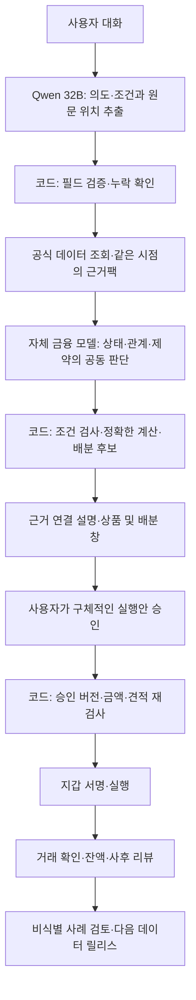

> Historical record. Current product, setup and verified scope: [faat README](../../README.md).

# GWDC TRON B × Furiosa A — 금융 전용 에이전트 구축안

> 2026-09-28 현재 기준: [통합 웹서비스 아키텍처](TRON_FURIOSA_UNIFIED_ARCHITECTURE_20260928.md). Qwen3 32B를 사용하며 BYON/고객 노드를 제품에서 제외한다. 아래는 이전 결정의 역사 기록이다.

2026-09-23 · v0.2 역사 문서. 2026-09-25 사용자 정정 후 제품/대회 아키텍처는 [FS1 BYON](FS1_NODE_GWDC_ARCHITECTURE_20260925.md)이 우선한다. 멀티 트랙, Qwen 32B, 대화형 작업 공간 방향은 유지하되 고객 컴퓨팅은 **고객의 자기 노드**가 담당한다. 아래 모델 중심 문단은 당시 가설이다.

아래는 당시 트랙 대응과 데이터 계획 기록이다. 현재 구현 상태는 [README](../../README.md)를 따른다. 기존 [데이터셋 계획](DATASET_PLAN_20260921.md)의 상품·지표·출처·비용·UI 설계를 이어받되, 자체 신경망 학습을 제품의 필수 경로로 삼지 않는다.

## 1. 한 제품, 두 트랙

**만들 제품:** 사용자의 자산·기간·유동성 조건을 대화로 파악하고, TRON의 근거 있는 배분안을 비교한 뒤 사용자가 승인한 범위에서 실행과 사후 확인을 돕는 금융 에이전트.

| 제출 관점 | 같은 제품에서 보여줄 부분 | 제출 증거 |
|---|---|---|
| TRON B | JustLend·USDD 정보, 실질적으로 다른 두 배분안, 비용·출구·위험, 승인과 포지션 리뷰 | 데이터 릴리스, 계산 입력/결과, 계획과 실행·보유 기록 연결 |
| Furiosa A | Qwen 32B를 이용한 금융 의도·조건 해석, 사용자 조건을 지키는 서비스, 블록체인 연결 | 실제 제공 API 호출, 흐름별 토큰/시간, 테스트넷 거래와 대응 로그, 조건을 바꾼 재실행 |

멀티 트랙 가능 여부와 Qwen 32B 변경은 **사용자가 확인해 준 최신 조건**으로 채택한다. 별개 앱 두 개로 공수를 나누지 않고 공통 데이터·판단·계산·화면·실행을 사용한다. 제출 시에는 트랙별 요구와 그 증거를 각각 연결한다.

9월 23일 읽은 공식 Furiosa A 공개 브리프에는 이전 모델인 `gpt-oss-120b` 및 Kiln이 남아 있다. 사용자 최신 안내에 따라 모델 기준을 Qwen 32B로 갱신한다. Qwen 세대·Instruct/Thinking 변형·정확한 모델 ID·제공 endpoint·Kiln 유지 여부는 변경 공지 또는 참가자 환경에서 확인한다. 확인 전 다른 Qwen을 임의로 골라 대회 지정 모델이라고 보고하지 않는다. [F1][F2]

같은 브리프는 devnet/testnet의 거래 최소 1건과 대응 로그, 사용자 조건을 바꾼 두 번의 재실행, 흐름별 사용량과 에너지 근거를 요구한다. 기준 실행 1회 + 조건 변경 2회를 준비한다. 기록용 거래가 허용된다는 조건을 활용할 수 있지만, 기록 거래만으로 실제 JustLend 예치가 성공했다고 주장하지 않는다. [F2]

## 2. 우리가 소유할 구조

작업명은 **Financial Decision Core(FDC), 금융 의사결정 코어**다. 이름보다 다음 네 자산이 중요하다.

1. **금융 상태 데이터:** 상품의 의미·단위·기준시점·출처·실행 가능 경로가 연결된 정본.
2. **판단 사전:** AI가 답할 작은 질문, 허용 답, 필요한 근거, 유보 조건을 명시한 계약.
3. **판단 사례 데이터셋:** 어떤 상태에서 어떤 답을 해야 하며 조건을 하나 바꾸면 답이 어떻게 달라지는지 검토한 사례.
4. **실행 결과 기록:** 사용자가 본 안, 승인 범위, 실제 요청, 거래 결과, 비용과 사후 성과를 연결한 기록.

미래에셋 EFOS에서 가져올 것은 상품/지표 사전과 질의·근거 계약이다. 여기에 시계열, 사용자 조건, 행동 제한, 승인 버전, 결과를 더한다. 데이터 구조가 AI 이해를 돕는다는 가설은 비교 실험으로 검증한다. 프롬프트만 길게 쓰거나 JSON 필드를 늘린 것을 성능 개선으로 간주하지 않는다.

### 자체 모델을 구축하는 범위

사용자 정정에 따라 목표를 **금융 상태·시간·관계·제약을 함께 처리하는 신경망 아키텍처와 자체 학습 가중치**로 확장했다. JEV는 비교 대상 중 하나다. 작은 판단 API를 모사하는 것을 제품의 핵심 연구 성과로 삼지 않는다.

제안 모델은 금융 수치·시간 인코더, 상품 간 관계 attention, 근거 및 제약과의 결합 블록, 병렬 계획 후보·근거·질문·유보 출력부로 구성한다. [신경망 소스 초안](../../research/fdc/model.py)을 작성했으며 실행·학습 검증은 아직 하지 않았다. 구체 텐서, 학습 목적, 데이터 확장, 제거 실험은 모델 명세에 둔다.

Qwen 32B는 대화·조건 해석·설명을 담당하며 자체 모델의 비교 기준선과 검토된 학습 초안 생성에도 활용할 수 있다. 금융 코어는 별도의 학습 가능한 구조다. 정확한 금액 계산, 예산 집행, 승인 검증은 코드가 맡는다. 대회 제출에는 실제로 구현·검증한 수준을 표시하며 자체 모델을 학습 완료로 앞서 주장하지 않는다.

## 3. 실행 구조

각 단계는 실행 상태로 기록한다. `needs_version → snapshot_id → decision_id → plan_hash → consent_id → execution_id → receipt_id`가 연결되어야 한다. 실패와 유보도 결과이며 기록에서 사라지지 않는다.

**모델이 담당할 일:** “생활비는 남겨 둬”의 의미, 기간·조건 원문 추출, 사용자 질문과 문서의 관련성, 문장이 주장을 지지하는지, 필요한 역질문, 근거 있는 설명.

**코드가 담당할 일:** 토큰 식별/자릿수, 시각·만료, 예산·수수료·잔액·최소 수취량, 상품 참여 규칙, 수익 계산, 비중 합계, 승인·서명 검증, 중복 방지, 거래 상태 확인.

“이 거래를 허용할까”를 모델 확률 하나로 결정하지 않는다. AI의 의미 해석이 실행 조건에 영향을 주면 사용자에게 확인된 구조화 조건으로 먼저 고정한다. 모호한 문장에서 금액·기한을 임의로 채우지 않는다.

## 4. 금융 판단 사전

| 판단 | 입력 | 허용 답 또는 출력 | 금융에서 필요한 이유 |
|---|---|---|---|
| intent.route | 사용자 발화, 현재 화면/대화 상태 | DISCOVER / COMPARE / PLAN / REVISE / REVIEW / EXIT / UNCLEAR | 조회와 구매·출금 의도 구별 |
| needs.interpret | 발화 + 직전 확인 조건 | 필드 후보, 원문 위치, 변경/유지, 누락 | 금액·기간·유동성 요구 보존 |
| meaning.metric | 문장 + 지표 사전 | BASE_APR / TOTAL_APY / REWARD_RATE / BORROW_RATE / UNKNOWN | 높은 차입금리를 공급 수익으로 읽지 않음 |
| evidence.relevance | 질문 + 출처 문단 | DIRECT / CONTEXT / IRRELEVANT / INSUFFICIENT | 불필요한 문서로 입력을 채우지 않음 |
| evidence.support | 검증할 주장 + 근거 | SUPPORTED / CONTRADICTED / INSUFFICIENT | “예시 APY”를 “현재 APY”로 설명하지 않음 |
| terms.interpret | 약관 + 사용자 조건 + 규칙 후보 | 구조화 규칙 후보와 근거 위치, 또는 UNKNOWN | 신규 약관 의미를 사람이 검토할 수 있게 추출 |
| change.interpret | 기존 조건 + 새 발화 | 금액/기간/허용상품 등 변경 필드 | 한 필드 변경을 전체 승인으로 확대하지 않음 |
| explanation.select | 검증된 계획·근거·질문 | 사용할 claim_id 목록 | 설명이 계산 엔진 밖의 숫자를 만들지 않음 |

이 사전은 초기 보조 태스크의 라벨 구조다. 4종(`intent.route`, `meaning.metric`, `evidence.relevance`, `evidence.support`)의 초안이 있으며, 자체 모델 학습에는 에피소드 V2의 공동 상태·후보·조건 변경 데이터를 추가한다. 네 종류 분류만으로 전체 모델을 학습했다고 부르지 않는다. 모든 판단에는 `UNKNOWN/UNCLEAR/INSUFFICIENT`에 해당하는 유보 경로가 있어야 한다.

일반 모델이 직접 적어 낸 0.97 같은 수치는 검증된 정확도 확률이 아니다. v0는 **확신도 숫자를 요구하거나 UI에 표시하지 않는다.** 이후 별도 calibration split으로 보정한 경우만 `calibration_version`, Brier score, ECE, coverage/오류율을 함께 보고한다. 로그확률·다수결·자기평가 어느 것도 자동으로 확률 보정이 되지는 않는다.

## 5. 데이터셋의 기본 단위

상품 행이나 질문·답변 두 줄 대신 **의사결정 에피소드**를 보존한다. 한 에피소드에서 여러 작은 판단 사례를 파생시키되 원래 에피소드와 조건 변경 가족을 유지한다.

| 데이터 묶음 | 담을 내용 | 재사용처 |
|---|---|---|
| FactStore | 원문, 정규화 사실, 단위, 대상, 시점, 유효기간, 출처, 참여·출구 규칙 | 검색·계산·설명·라이브 갱신 |
| DecisionSet | 상태, 질문, 후보 답, 근거 위치, 검토 정답, 유보 이유 | Qwen 프롬프트/평가, 후속 모델 학습 |
| CounterfactualSet | 기준 사례와 한 조건만 바꾼 사례, 변화해야 할 답·불변 조건 | 제약 보존·민감도·회귀 평가 |
| ActionTrace | 계획·승인·견적·거래·실제 비용·결과·실패 | 실행 검증, 사후 설명, 오류 분석 |
| InferenceTrace | 흐름/단계, 모델/설정, 입력/출력 사용량, 시간, 재시도, 캐시, 상태 | Furiosa 효율 평가 |

한 사례에는 다음이 필요하다.

- ID, schema/task 버전, episode/family ID, 데이터 모드와 split.
- 발화·사용자 확인 조건, 관련 사실만 모은 상태, as_of와 데이터 릴리스.
- 판단 질문과 허용 답, 자료 ID 및 정확한 문자 구간/JSON 경로.
- 정답 라벨과 짧은 검토 근거, 정답 확정 방식, 검토자·검토 상태.
- 실제 관측/문서 기반/합성 구분, 이용 권한과 개인정보 상태.

다음은 정답으로 넣지 않는다: 모델 자신의 추론문, 미래 가격을 본 최적 배분, 실행하지 않은 성공 기록, 검토되지 않은 AI 생성 답. 사용자 승인도 모델이 생성하는 정답 라벨이 아니라 실제 UI 이벤트와 서명 검증 기록이다.

이번에 만든 [초기 사례](../../cases/seed_decisions.jsonl)는 **합성 개발 초안 16건**이다. 실데이터나 사람 검토 골드가 아니며, 학습·봉인 평가용으로 바로 승격하지 않는다. [스키마](../../contracts/decision_case.schema.json)와 [라벨링 안내](DATASET_CARD.md)를 함께 사용한다.

## 6. 수집·라벨링 작업 순서와 수량

1. **핵심 질문 30개 → 필드/출처 대응:** 원문과 함께 답할 수 있는지 판단한다. 못 답하는 질문은 데이터 공백으로 남긴다.
2. **깊이 검증한 경로 3개 목표:** JustLend와 USDD의 직접 자료를 각각 연결한다. 조사만 한 후보와 실행 가능한 경로를 구별한다.
3. **작업 가능한 골드 120개 최소:** 기존 계획 14절의 10개 유형 × 12개 에피소드. 각 유형 안에 의미 판단·조건 변경·유보를 넣고 하나의 에피소드에서 여러 atomic case를 파생시킨다.
4. **300개 확장 목표:** 유형당 30개. 개발 150 / 보정 50 / 봉인 100을 가족 단위로 먼저 배정한다. 실제 학습셋은 이 평가셋과 별도다.
5. **검토 후 변형 600~1,200개 선택:** 표현만 바꾼 예는 독립 골드 수를 늘리지 않는다. 난이도·부정 예·유보 예가 고르게 포함되는지 확인한다.

같은 원문, 같은 시나리오의 패러프레이즈, 같은 조건 변경 가족은 같은 split에 둔다. 시간 기준도 분리하여 최신 정보가 과거 답에 누출되지 않게 한다. 봉인셋을 보고 수정했다면 새 봉인셋이 필요하다. 50개 보정셋은 착수 규모일 뿐 세부 유형별 확률 신뢰성을 입증하기에는 부족할 수 있다.

**사람 검토:** 원문·규칙·독립 계산으로 정답을 확정한다. 모델은 후보와 문단 위치를 제안할 수 있다. 금액·단위·승인·실행에 영향이 있는 라벨은 두 검토자가 확인하고, 불일치는 합의/유보로 남긴다. 검토 인력이 한 명이면 단독 검토임을 표시하고 골드 신뢰 수준을 낮춘다. 생성 모델과 같은 모델의 자기 채점만으로 통과시키지 않는다.

**권한/개인정보:** 공개 API 접근 가능과 원문 재배포/모델 학습 허용은 별도다. 원천마다 열람·보존·재배포·학습 허용 상태를 기록한다. 사용자 지갑·발화는 동의 범위 내 최소 데이터만 비식별화한다. 개인키·세션 토큰은 포함하지 않는다. 외부 문서의 지시는 관측 자료이며 시스템 명령이 아니다.

## 7. Qwen 32B를 금융 판단에 맞게 사용하는 방법

먼저 모델 이름과 endpoint, 실제 사용량 필드, tool calling/JSON 제약, context 길이, reasoning 옵션을 **참가자 환경에서 짧은 적합성 검사**로 확정한다. 보통의 Qwen 문서나 Furiosa SDK 지원 목록을 대회 endpoint 지원으로 치환하지 않는다.

9월 23일 공개 Kiln 문서는 `response_format` 미지원과 JSON 프롬프트 후 클라이언트 검증을 안내한다. 이는 공개 기존 배포의 정보다. 새 Qwen endpoint에서도 동일하다고 단정하지 않되, 지원 확인 전 설계는 다음의 보수적인 계약을 따른다. [K1][K2]

- 정해진 태스크별 최소 상태와 짧은 허용 답만 요청한다. 발화 금액은 원문 위치와 함께 후보로 받는다.
- 스키마 검사, 허용 ID/enum, 근거 구간, 사용자 조건 및 참조 무결성을 코드에서 검사한다.
- 형식 오류는 짧은 수정 요청 1회로 제한한다. 총 호출 예산에 재시도·전송 실패를 모두 포함하고 재실패하면 유보한다.
- 서로 독립인 질문만 한 호출에 묶는다. 의도 추출 결과를 필요로 하는 검색과 계획은 순서를 지킨다. 여러 판단을 묶었을 때 간섭이 생기는지도 따로 측정한다.
- 모델에 송금·서명 도구를 직접 노출하지 않는다. 허용된 읽기 요청도 코드의 태스크/인자 검사를 통과해야 한다.
- 최신 금리·잔액·유동성을 학습시키거나 장기 캐시하지 않는다. 캐시 키에 사용자 조건/태스크/모델/근거 스냅샷 버전을 넣고 유효기간을 넘으면 무효화한다.

**한 요청의 목표 호출 설계(측정 전 가설):** 조건 해석 1회 → 조회 후 의미/근거 판단 1회 → 필요한 경우 설명 1회. 화면 수치·비중·비용은 코드가 채운다. 상품마다 별도 대화를 반복하지 않는다. 모든 요청이 3회 이내로 해결된다는 보장은 아니며 역질문 턴과 실패를 포함한 실제 전체 비용을 보고한다.

## 8. ‘구조가 효과 있다’는 것을 입증할 비교 실험

아래는 Qwen 중심 기준선 실험이다. 독자 신경망, 단순 MLP, 정확한 최적화, 관계/시간/loss 제거 실험은 최신 모델 명세 9절을 따른다.

모두 같은 Qwen 32B endpoint/모델 revision, 동일 질문·시점·타임아웃·정답 판정 기준으로 비교한다.

| 실험 | 입력과 처리 | 분리해 확인할 효과 |
|---|---|---|
| A | 원시 API + 문서, 일반 대화형 요청 | 기준선 |
| B | EFOS식 대상·단위·시점·출처 정본 | 데이터 의미 구조 |
| C | B + 작은 금융 판단 질문/허용 답/유보 | 전용 판단 계약 |
| D | C + 코드 계산·조건 검사·근거 연결 | 전체 시스템 |

동일 상한을 둔 품질 실험과 실제 가변 사용량을 재는 효율 실험을 구별한다. 독립 질문의 일괄 요청, 문서 축소, 캐시, reasoning 설정은 한 요인씩 바꾸고 콜드/웜 결과를 나눈다. D의 개선을 모델 자체 성능이나 데이터 형식 하나의 공으로 표현하지 않는다.

측정값: 조건 추출 정확도, 근거별 지지 판정, 거짓 실행 가능 판정, 계산/단위 오류, 적절한 유보와 완결 응답률, p50/p95 시간, 요청/수정 횟수, 흐름별 입력·출력·가능하면 reasoning 토큰, 성공 1건당 전체 비용. 평균에 숨기지 말고 유형별 분모와 실패 사례를 공개한다.

**에너지:** 토큰 감소를 전력 감소율로 그대로 바꾸지 않는다. 제공자가 반환한 계측치가 있으면 출처·측정 범위와 함께 보고한다. 없다면 전력×처리시간×귀속 비율 등 가정과 상·하한을 명시한 추정치를 별도 칼럼에 두거나 에너지를 미측정으로 남긴다. NPU의 TDP×API 지연시간은 네트워크/대기/공유 부하를 구분하지 못하므로 실제 요청 전력 측정치라고 부르지 않는다.

## 9. 화면과 승인을 데이터에 연결

처음 보이는 것은 대화창이다. AI가 검색하면 옆 작업 공간에 상품 비교와 배분안이 열린다. Fomo의 상품·주문 정보 위계와 WHOLLET의 대화·작업 공간 구조를 적용한다. 기존 계획 19절의 화면 계약을 유지한다.

사용자 예시: “2,000 USDT가 있고 한 달 뒤 필요해. 500은 바로 쓸 수 있게 남겨 둬.”

Qwen은 조건과 누락을 해석한다. 코드는 500을 예산에서 보존하고 실제 조회 시점의 비용/조건을 반영한다. 두 계획의 비중·기대 수익·출금 조건을 보여주되, 현재 조회가 없으면 수치를 만들지 않는다. 사용자 수정으로 예산이 줄거나 허용 상품이 바뀌면 기존 계획과 승인 카드는 무효가 된다.

최종 카드에는 무엇을 얼마에 구매·예치하는지, 총 지출과 비용, 남는 자산, 위험/출구, 만료 시점을 담는다. “이대로 구매·배분”은 해당 버전과 행동 범위에 묶인다. 지갑 서명 후에도 거래 확인 전에는 완료로 표시하지 않는다. 여러 거래는 부분 성공·실패·미확정을 구별한다.

**모델의 ‘승인 의도’ 분류는 승인 기록을 대신하지 않는다.** 서명·실행 경계의 코드가 현재 계정/네트워크, 계획 해시, 금액·허용 계약·기한·비용 상한을 다시 확인한다. 향후 리밸런싱이나 자동 복구 거래까지 권한을 넓히지 않는다.

## 10. 두 트랙을 함께 설명하는 데모

1. **기준 흐름:** 사용자 조건 → 실제 Qwen 호출 → JustLend/USDD 근거 조회 → 두 안 → 수정·승인 → 허용된 테스트넷 동작 → 거래 해시와 같은 기록 → 포지션/결과 화면.
2. **조건 변경 A:** 예산을 줄인다. 수수료까지 포함하면 기존 계획이 초과하므로 재계산/중지된다. 옛 카드와 승인으로 진행할 수 없음을 보인다.
3. **조건 변경 B:** 사용자가 특정 자산/프로토콜을 제외한다. 제외된 경로를 제거하고 새 안을 만들거나 가능한 안이 없다고 알린다.

실제 프로토콜 테스트넷 경로가 없으면 계약이 허용하는 기록형 시연과 실제 자산 실행 기능을 분리한다. 메인넷 읽기 근거 + 테스트넷 기록은 각각 환경을 표시하고, 전체가 실예치 E2E라는 표현을 사용하지 않는다. TRON B의 실행 요구 충족 범위도 별도 판정한다.

README 기능 선언 초안: “이 프로젝트는 사용자의 기간·유동성·예산 조건으로 TRON 자산 배분안을 비교하고, 구체적인 승인 범위 안의 실행과 사후 결과 확인을 돕는 AI 자산관리 에이전트입니다.”

## 11. 9월 23일 기준 일정

공식 행사 페이지는 등록 9/25까지, 현장 코딩 9/28 20:00~9/30 11:00, 제출 9/30 12:00 이전으로 안내한다. 이전 문서의 코딩 시작 19:00은 최신 공개 일정에 맞춰 수정한다. 사전 준비물·기존 코드 활용 허용 범위는 제출 규정과 구분해 확인하며 준비 내역을 기록한다. [F1]

| 시기 | 우선 작업 | 산출/판정 |
|---|---|---|
| 9/23 | 두 트랙 통합 명세, 판단 사전·스키마, Qwen 환경 확인 항목 | 현재 문서·초기 사례; 모델 호출 성능 미측정 |
| 9/24 | 핵심 질문/필드와 공식 원천 샘플, 경로 3개 검토 | 원문→정형 사실 추적, 미확인 경로 제외 |
| 9/25 | 최소 골드 120개 목표, 라벨 검토, split 고정 | 사람 검토 진행률 및 부족 유형 |
| 9/26~27 | 데이터팩·계약·데모 입력 정리, 규정상 허용되는 준비 | 라이선스/출처/기존 코드 목록, 원격 접근·API 환경 준비 |
| 9/28 코딩 시작 후 | 수집/판단/계산/화면 최소 경로 통합 | 실제 제공 모델 호출과 사용량 기록 |
| 9/29 | 테스트넷 연결, 조건 변경 두 흐름, 품질/효율 비교 | 거래와 로그 일치, 실패 원인 확인 |
| 9/30 11:00까지 | 기능 동결, 제출 근거·영상·README | 두 트랙 증거 매핑, 12:00 이전 제출 |

대회 데모의 최소 범위는 120개 검토 사례, 3개 검증 경로다. 자체 모델 연구는 핵심 목표로 진행하며, 학습·검증 결과에 따라 제출 가능한 수준을 결정한다. 대형 그래프 DB와 고급 자동 리밸런싱은 후순위다. 평가용 120개와 별도로 자체 모델의 학습 데이터를 구축하며, 수량 때문에 검토 품질을 낮추지 않는다.

작업 장소: 9/24 최신 사용자 지시에 따라 Mac은 문서·소스 편집 및 작은 읽기에 한정하고, Cherry의 `/srv/skew/gwdc-financial-agent-20260924`에서 공개 원천 수집·테스트·합성 FDC 학습을 실행했다. 제공 Qwen 32B 실호출과 테스트넷 구체 실행은 필요한 참가자 환경과 승인 범위를 갖춘 뒤 진행한다. 최신 확인 결과는 [README](../../README.md)에 기록한다.

## 12. 구현 순서와 완료 기준

| 순서 | 만들 모듈 | 통과 조건 |
|---|---|---|
| 1 | source registry / snapshot / normalize | 금액 문자열·단위·시점·출처·원문 위치가 손실 없이 이어짐 |
| 2 | decision contracts / data labeling | 검토된 유형별 사례, 유보·조건 변경 포함, split 누출 없음 |
| 3 | Qwen adapter / task router / trace | 실제 지정 endpoint, 엄격한 출력 검증, 재시도 상한, 사용량 기록 |
| 4 | financial calculator / policy checker | 독립 정답과 비용·유동성·허용 범위 검사 일치 |
| 5 | chat / workspace / plan cards | 표시 값·계획 해시·수정 버전 일치 |
| 6 | consent / executor / receipt | 승인된 행동만 진행, 거래 상태와 결과 증거 일치 |
| 7 | benchmark / release | 두 트랙 증거, 품질·사용량·미측정 항목을 정직하게 공개 |

**이번 작성:** 통합 구축안, 자체 모델 명세·신경망 소스 초안, Qwen 32B 결정 반영, 데이터 계약 초안, 합성 사례 16건, 검토 규칙. **남은 작업:** 신경망 원격 검증·학습·평가, 실원천 적재, 사람 검토 골드, Qwen 호출·벤치마크, 앱 구현, 승인된 테스트넷 실행. 소스 작성이나 합성 사례를 검증된 모델·데이터셋 완성으로 세지 않는다.

## 출처와 확인 범위

- [F1] [주최 측 행사 페이지](https://luma.com/be2le0l0), 2026-09-23 조회. 트랙 명칭·공식 브리프 연결·일정 확인. 멀티 출전은 사용자 확인 사항.
- [F2] [FuriosaAI × Bricksum 공식 Challenge Brief](https://docs.google.com/document/d/13qh7oePGl7Flrl-Zh_A6hfr02L266PvS/edit), 행사 페이지에서 연결된 문서의 공개 텍스트 export를 2026-09-23 직접 읽음. 모델 표기는 사용자 최신 안내와 차이가 있어 Qwen 32B로 계획 갱신.
- [J1] [TypeSafe 공식 Introduction](https://docs.typesafe.ai/introduction), [공식 발표](https://typesafe.ai/blog/introducing-system-one-models-and-jev), 2026-09-23 조회. 구조 설계의 참고이며 자체 성능 증거가 아님.
- [K1] [Kiln API Reference](https://kiln.bricksum.com/docs/en/api-reference), [Models](https://kiln.bricksum.com/docs/en/models), 2026-09-23 조회. 공개 배포 정보이며 변경된 대회 Qwen endpoint와의 일치는 미확인.
- [K2] [Kiln 지원 제한](https://kiln.bricksum.com/docs/en/migrating-from-openai), 2026-09-23 조회. 새 endpoint에서도 기능별 적합성 검사 필요.
- 금융 원천과 UI 확인 범위는 [기존 계획의 출처 목록](DATASET_PLAN_20260921.md)을 따른다. 해당 문서의 9/21 관측을 9/23 라이브 시장 관측으로 취급하지 않는다.
