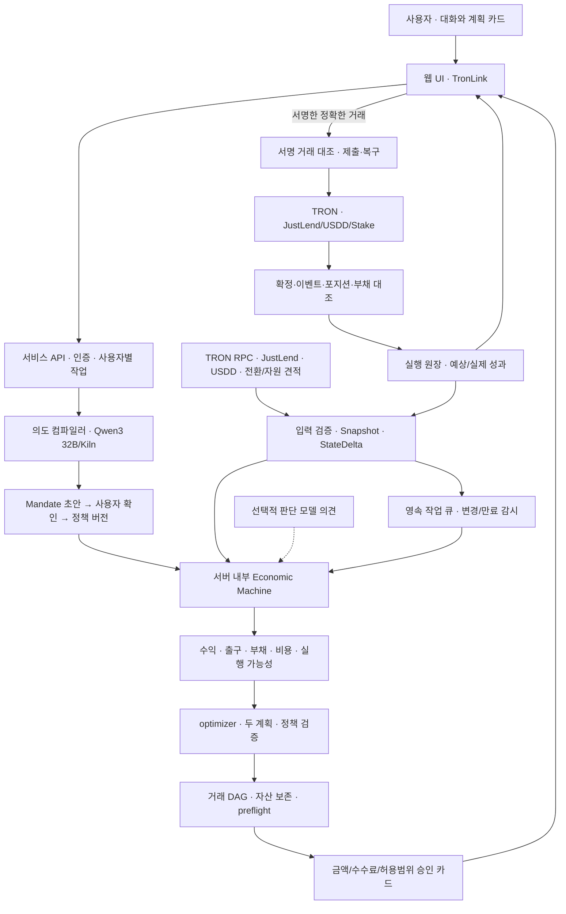

> Historical record. Current product, setup and verified scope: [faat README](../../README.md).

# TRON Economic Machine — 통합 웹서비스 아키텍처 v1

2026-09-28. 상태: 구현 전 통합 설계. 기존 구현의 최신 기준은 `MACHINE_ECONOMICS_CORE_20260925.md` v0.28이다. 이 문서는 이후 제품 방향을 정하며 기존 기능의 완료를 뜻하지 않는다.

**최신 사용자 결정: 고객 소유 노드/BYON/SSH·runner API 가입/노드 네트워크를 제품에서 제외한다. 모델은 Qwen3 32B다.** 일반 웹서비스의 백엔드가 관측·계산·작업 기록을 담당하고 사용자는 웹과 TronLink를 사용한다. Cherry는 현재 개발·테스트 장소이며 운영 서비스 배포 완료를 뜻하지 않는다. 실제 TRON 접근을 위한 외부 RPC는 프로토콜 접속 수단으로만 남는다.

실행 순서는 [10개 PR 계획](TRON_FURIOSA_10PR_PLAN_20260928.md)을 따른다. 과거 BYON 문서·구현은 역사적 참조이며 신규 고객 경로가 아니다. 이 설계에서는 데이터셋 생산·새 모델 학습·하드웨어 최적화를 추가 작업으로 넣지 않는다.

## 1. 첨부를 전부 읽은 기록

원문: 사용자 첨부 전체 (local development reference, not redistributed). 678줄, 17,310바이트. SHA-256: `0eb8a48ebb30f7a0cba689f358134525e8f2b6ea49f9410e5ff0e0d2291f289f`.

| 원문 위치 | 읽은 내용 | 통합 결정 |
| --- | --- | --- |
| 1–4 | TRON B는 금융 본체, Furiosa A는 AI·효율성 계층 | 동일 제품에 두 트랙 증거를 연결 |
| 5–140 | 의도→상태→수익→판단→실행 가능성→optimizer→정책→거래→사전 검사→승인→실행→사후 검증 | 한 실행 상태 기계로 통합 |
| 142–182 · 1절 | gpt-oss가 사용자 조건을 Typed Mandate로 변환 | 최신 사용자 결정의 Qwen3 32B로 교체. 원문 위치·누락·확인 이력을 보존 |
| 184–261 · 2절 | 의도 컴파일 뒤 LLM 루프 종료, 반복 계산 토큰 0 | 정책 버전당 컴파일. 조건 수정·질문·정해진 예외에서는 다시 호출 가능 |
| 263–314 · 3절 | 작은 판단 모델은 지속성·위험·상대가치·리밸런싱 점수 | 선택적 의견 모듈. 정확한 금액과 승인 권한을 주지 않음 |
| 316–374 · 4절 | optimizer가 비중 계산, 최소 두 플랜 | 같은 확인된 정책 안에서 서로 다른 두 적격안. 불가능하면 이유를 표시 |
| 376–423 · 5절 | 유동성/TRX 노출/단건 금액/허용 프로토콜 강제 | 계산·사전 검사·실행 경계에서 반복 검사 |
| 425–487 · 6절 | Approve/Supply/Stake 거래와 Nile tx hash | 자산 조달/전환 단계, 거래별 승인, 실패 복구를 추가 |
| 489–508 · 7절 | USDD mainnet 조회와 JustLend Nile 실행 구분 | 서로 다른 run/network로 표시. 하나의 실제 배분 실행으로 합산하지 않음 |
| 510–550 · 8절 | 같은 시장에서 조건을 바꾼 두 번의 실행 | 시장 snapshot 고정, 정책 버전 변경, 계획·거래 변화와 기록을 검증 |
| 552–592 · 9절 | 흐름별 토큰·호출·에너지 계측 | 수집/계산/지갑/체인 지연까지 분리. 에너지 미측정은 null |
| 594–616 · 10절 | AI와 코드 역할표 | 모델은 조건/설명, 코드는 계산/검증/거래/정산 |
| 618–667 · 11절 | 두 트랙이 동일 제품을 서로 다른 관점으로 평가 | 트랙별 요구→실행 증거 색인 |
| 669–678 · 결말 | 자연어를 정책으로 컴파일하고 저토큰 운용 | 웹서비스로 제공하는 결정적 경제 런타임으로 채택 |

원문을 그대로 구현하면 생기는 문제도 수정한다.

1. `gpt-oss-120b` 대신 사용자 확정 모델인 **Qwen3 32B**를 사용한다. 공개 Kiln 카탈로그는 `qwen3-32b`를 제공 상태로 표시하지만 실제 계정의 인증된 `/models` 응답·사용량·실행 환경 증거는 따로 확보한다.
2. 최소 유동성 30% 조건인데 Plan B 현금이 20%다. 즉시 지갑 현금 조건이면 위반이다. 대출 상품의 회수 가능액을 유동성에 포함하려면 별도의 시간·용량·출금 근거가 있어야 한다.
3. “가격 베팅 싫음”을 TRX 노출 20% 허용으로 자동 해석하지 않는다. 사용자 확인 전에는 TRX/sTRX/TRX 담보의 가격 노출을 허용하지 않는다.
4. 현재 USDD 2,000에서 목표 예치 3,000으로 가는 원문 거래 목록에는 1,000 USDD 조달 단계가 없다. 잔액 보존 검사와 견적 있는 전환 또는 계획 조정을 선행한다.
5. 원문의 예시 APY·토큰 수·confidence는 실측값이 아니다. 우리 화면·증거에는 계산 또는 실제 계측값만 쓴다.
6. 메인넷 수익률과 Nile 실행을 연결해 메인넷 상품에 실제 예치했다고 표시하지 않는다.
7. USDD Vault가 수익을 직접 지급한다고 가정하지 않는다. 담보·부채 경로와 발행 USDD의 별도 운용 경로를 모두 계산한다.

## 2. 현재 구현과 차이: 15개 계층을 같은 기준으로 판정

기준: **모듈 검증**은 제한된 입력/테스트 안에서 동작함, **부분**은 구현은 있지만 앞뒤 고객 경로 또는 실원천 연결이 없음, **연구**는 운영 경로에 승격되지 않음, **미구현**은 고객용 기능이 아직 없음이다. 2개 모듈 검증 / 8개 부분 / 1개 연구 / 4개 미구현이다. 난이도가 다른 계층의 단순 개수이므로 제품 완성률로 환산하지 않는다.

| 계층 | 현재 판정·근거 | 남은 연결 | PR |
| --- | --- | --- | --- |
| 1. 의도 컴파일 | 부분 — `src/finagent/qwen.py`에 API 어댑터·금액/기간/누락 검증·토큰 이벤트 | Qwen3 실제 호출, 확인된 Mandate, 원문 충실성, 자산·부채·노출 조건 | 1, 5 |
| 2. TRON 상태 | 부분 — `finagent/collect.py`, `normalize.py`, `store.py`, `economic_machine/state.py` | 수집 정본을 경제 상태에 연결; wallet/allowance/부채/자원/출금 queue | 2 |
| 3. 수익 계산 | 부분 — `economic_machine/tron_yield.py` 7종 유형 | 실제 수익·수수료·기간·전환·자원·출구 계산의 인증된 입력 | 3 |
| 4. 작은 판단 모델 | 연구 — `research/fdc/`에 학습/평가 코드 | 독립 평가·보정·실데이터 우위 증거 없음. 운영 필수 의존성으로 사용하지 않음 | 5 |
| 5. 실행 가능성 | 부분 — 용량·유동성 일수·스트레스·부채비율 검사 | 자산별 자금 조달, 즉시 현금과 시간별 회수, 실제 비용/가스 | 3, 6 |
| 6. optimizer | 모듈 검증 — `portfolio.py`, `grid_search.py`, 최대 4,096개 격자 후보 | 실데이터 가정 검증과 실제 경로 연결. 현재 최적성은 정해진 격자 안에서만 | 4 |
| 7. 정책·불변조건 | 모듈 검증 — `compiler.py`, `kernel.py`, `runtime.py`, 자본 잠금·저널 | 한 Mandate로 여러 정책 타입 일치, tenant/지갑 확인·실행 시 재검사 | 1, 4, 7 |
| 8. 거래 컴파일 | 부분 — `basket.py`, `chain_binding.py`, `vault_batch.py` | 실제 ABI 인코딩과 프로토콜별 거래 DAG. 현재 route bytes는 호출자 입력 | 6 |
| 9. 실거래 preflight | 미구현 — 가격/quote와 가상 사후 상태 검사는 있음 | RPC 시뮬레이션, Energy/Bandwidth, allowance, minOut, 실제 사후 상태 범위 | 6 |
| 10. 고객 승인·실행 | 미구현 — `finagent/server.py`의 `/api/approve`가 403 | 지갑 승인, 반환 거래 검증, broadcast, timeout 대조 | 7, 8 |
| 11. 사후 확인 | 부분 — `tron_consumption_read.py`, 실행 lifecycle 검사 | registry consume는 체결 아님. 실제 상품 지분·부채·이벤트·소유자 대조 | 8 |
| 12. 지속 감시 | 부분 — `finagent/fs1_runner.py`와 `MachineRuntime.ingest/tick` | 두 루프를 hosted worker 하나로 접합, TTL 만료·재계획·재시작 복구 | 9 |
| 13. 실제 성과 | 미구현 — 연구용 이력은 있음 | 실행된 포지션 기준 수익/가격손익/보상/비용/부채/외부 입출금 회계 | 8 |
| 14. 대화·카드 UI | 부분 — `web/`와 기존 API | 새 kernel 연결, 직원 역할, 승인 카드, 포지션·성과와 네트워크 구별 | 10 |
| 15. 웹서비스 운영 | 미구현 — 개발용 HTTP·읽기 수집 서비스 파일은 있음 | 사용자 인증·격리, 내구 작업 큐, 배포/복구/비밀 관리·관측 | 1, 9 |

2026-09-28 이번 대조에서 Cherry의 경제 코어/계약 격리 테스트 **142개 통과**를 다시 확인했다. 직전 전체 저장소 검증은 187개 중 163개 통과, 24개 건너뜀이었다. 5,171줄의 Python 비공백·비주석행, 639줄의 Solidity 비공백·비주석행, 3,976줄의 대응 테스트는 규모 기록이다. **실제 Qwen 호출→실데이터 계획→TronLink 승인→상품 실행→포지션 확인을 모두 연결한 성공 증거는 아직 없다.** 이번 설계 작성으로 이를 완료 처리하지 않는다.

## 3. 하나의 제품과 배치

제품 문장: **Qwen3 32B가 확인 가능한 금융 조건 초안을 만들고, Economic Machine이 TRON의 수익·유동성·부채·비용을 계산해 여러 계획과 실행 경로를 구성하며, 사용자 승인 후 실행 결과를 추적하는 자산관리 웹서비스.**



서버 배치는 `Web/API + worker + PostgreSQL + evidence object store`다. 초기 worker는 한 프로세스부터 시작하며 같은 owner/network/자산에 미해결 실행이 있으면 충돌 작업을 직렬화한다. PostgreSQL의 트랜잭션 outbox와 lease로 스케줄링하며 별도 메시지 브로커를 첫 버전 필수로 추가하지 않는다. core는 순수 계산 경계를 유지하고 DB/HTTP/LLM 호출을 import하지 않는다. 로컬 SQLite 구현은 테스트·재생용으로 유지한다.

ALPHA는 조건과 계획, VAULT는 현금·부채·승인, WATCH는 시장·출금·거래 상태를 담당하는 지속형 역할이다. 각각 별도 LLM 루프나 서버가 아니다. 역할별 Job, Routine, MandateVersion, 실행 원장과 읽기 권한이 있다. “항상 감시 중” 표시는 worker의 마지막 성공 관측·만료 상태로 결정한다.

### 요청과 작업 API

`/v1/mandates`, `/v1/plan-comparisons`, `/v1/execution-graphs`, `/v1/approvals`, `/v1/executions`, `/v1/positions`, `/v1/performance`를 같은 서비스에서 제공한다. 모든 요청의 tenant는 인증 세션에서 얻고 body가 지정한 다른 owner를 신뢰하지 않는다. 지갑 연결과 지갑 소유 증명, 거래 승인은 서로 다른 이벤트다. 재접속은 기존 job/approval 상태를 읽으며 새 실행을 만들지 않는다.

## 4. 각 계층의 책임과 공통 계약

Qwen3 32B는 의도·조건 수정·부족 정보·설명을 다룬다. 금액·허용 프로토콜·담보 차입 허용 여부를 사용자 발화에서 찾아 초안으로 반환하고 코드가 형식과 일관성을 검사한다. 사용자 확인 후에만 Mandate를 활성화한다. 사용자마다 모델을 계속 호출하지 않는다. 조건 변경과 새로운 설명 요청은 새로운 합당한 호출이며, “평생 한 번”이 아니라 **정책 버전 단위로 컴파일**한다.

| 버전 있는 계약 | 필수 의미 |
| --- | --- |
| `MandateV1` | tenant/owner/wallet/network, 자산별 원금, 기준 통화, 기간, 즉시 현금, 시간별 회수액, TRX/USDD/프로토콜 한도, 차입 허용, 부채/청산 완충, 단건/누적 금액·비용 상한, 허용 동작, 원문 참조, 확인 이력 |
| `ProductCapabilityV1` | chain+network+contract+version+action 식별, token decimals, 읽기/견적/시뮬레이션/실행/대조 지원 여부. `UNKNOWN`과 지원하지 않음을 분리 |
| `MarketSnapshotV1` | 값·단위·원천시각·수신시각·block/hash·만료·오류·원문 hash·조회 범위. 다른 network 스냅샷을 합쳐 실행 불가 |
| `ModelOpinionV1` | model revision, 입력 root, 예측 대상/기간, 점수·불확실성·유효기한·근거. 모델이 없으면 `NOT_USED`, 0 위험으로 바꾸지 않음 |
| `PlanComparisonV1` | mandate/state/math/adapter 버전, 탐색 범위, 두 적격안 또는 불가 사유, 상품별 금액·비용·위험·출구, USDD Vault 비교 상태 |
| `ExecutionGraphV1` | 상품별 단계, 자산별 입력/출력, 전제조건, 의존 단계, 금액 최소단위, recipient, calldata hash, fee cap, expiry, 지연 출금, 승인 범위 |
| `ApprovalV1` | 확인한 plan/graph/policy/network/account/단계/금액/비용/TTL hash. 계획 확인과 지갑 거래 서명을 구별 |
| `ExecutionReceiptV1` | 서명 payload hash, txid, 제출 상태, 확정 블록, protocol event, 실제 지분/원금/부채/비용, 실패·부분 완료·미확인 상태 |
| `PerformanceSnapshotV1` | 원래 예상과 가정, 외부 순입출금, 발생/실현 수익, 보상, 평가손익, 부채비용, 수수료, 가치평가 근거 |

한 trace는 `mandate_hash → snapshot_root → plan_hash → graph_hash → approval → signed_tx_hash/txid → position_receipt → performance`로 이어진다. 조건이 바뀌거나 계획 입력이 만료되면 이전 unsigned graph/approval을 무효화한다. 이미 서명·전송했을 가능성이 있는 거래는 취소됐다고 가정하지 않고 별도 대조한다.

기존 `Need`, `InferenceScope`, `BasketPolicy`, `EconomicProgram.sandbox`는 새 Mandate에서 컴파일한다. 정책 사본마다 사람이 같은 숫자를 다시 입력하게 하지 않는다. 현재 `tron_yield.py` 결과를 `authenticated_basket.py`로 바로 붙이는 통로는 없으므로 PR 4에서 인증된 원본부터 재생하는 명시적 브리지를 만든다. 출처 hash는 진실 증명이 아니고 다중 서명도 수익 최적성 증명이 아니다.

## 5. TRON을 활용하는 금융 계산

### 상품 universe

| 상품/동작 | 수익·자본 모델 | 필수 검사 |
| --- | --- | --- |
| TRX Native Stake | voting 수익 + TRX 가격 노출 | stake 자원/언스테이크/인출 대기, 투표 보상 권리·비용 |
| TRX Stake + Energy 제공 | voting + 실제 판매·위임 가능한 Energy 수익 | 견적 기간·수요·위임 잠금·회수, 자체 거래 사용 자원과 이중 계산 금지 |
| JustLend sTRX | 지분 교환비율과 이미 합산된 수익 | 수량·가격 노출, unstake 요청/청구 단계, 시장 매도와 출금 queue 구별 |
| JustLend USDT/USDD Supply | 기초 공급 이자 + 별도 보상 | active/legacy, 실제 underlying, 지분 자릿수, available cash·출금 조건 |
| USDD Vault | 담보 + 발행 USDD 자산 − 미상환 USDD/수수료 부채 | Vault 소유권, 담보종류별 한도/청산/부채 최소치·상한·상환/출금 |
| Vault + USDD 운용 | 위의 Vault와 목적지 공급을 연결한 합성 포지션 | 발행 자산 중복 NAV 금지, 목적지 출금과 부채 상환 순서, 통합 스트레스 |
| USDD 직접 Earn | route 확인된 경우에만 별도 상품 | `tronApy` 필드만으로 TRON 예치 경로를 인정하지 않음 |

공식 TRON B 브리프는 JustLend와 USDD 두 프로젝트 연동을 필수로 한다. **USDD Vault 필수 포함은 사용자가 추가로 정한 우리 제품 요건**이다. 모든 사용자에게 부채를 강제하는 뜻은 아니다. `allow_debt=false`이면 Vault를 제외 이유와 함께 비교하고 부채 없는 대안을 만든다. 기존 코드는 부채비율 한도는 있지만 명시적 차입 동의와 실제 Vault 소유/부채 상태 연결이 없어 새 Mandate·adapter가 필요하다.

`EconomicCapitalVault.sol`은 우리가 만든 미배포 자본 통제 실험이고 USDD Vault와 다른 계약이다. 두 이름을 UI나 adapter ID에서 혼용하지 않는다.

### 수학과 단위

- 금액은 자산별 최소단위 정수, 표시는 Decimal 문자열이다. USDT·USDD·TRX를 1:1로 가정하지 않는다. API의 APY 소수/퍼센트/bps, APR/복리 APY, 블록/초 단위를 원천별로 정규화한다.
- `NAV = 현금 + 지분환산 자산 + 담보 + 외부 운용 자산 − 부채 − 확정 비용`이다. 차입으로 늘어난 USDD를 자기자본 증가로 세지 않는다. 합성 전략을 부모 자산과 중복 보유로 집계하지 않는다.
- 기간 순수익은 공급/스테이킹/임대/회수 가능한 보상에서 진입·전환·네트워크·상환·출구·부채 비용을 차감한다. 현재의 선형 연율 proxy는 유지하되 표시하고, 실제 상품별 산식을 지원할 때만 해당 계산 버전을 사용한다.
- 즉시 지갑 현금 `C0`와 `Δt` 안에 회수 가능한 순금액 `L(Δt)`는 별도 제약이다. 출금 가능 표시, 시장 유동성, 지연 queue와 실제 회수량이 맞아야 L에 포함한다.
- TRX 가격 노출은 직접 TRX/sTRX/담보/미환전 보상을 합산한다. 프로토콜·USDD 디페그·공통 oracle·출구 의존성도 합성 상품을 관통해 계산한다.
- 손실 예측/forward yield는 관측 사실과 다른 가정이다. 기간·불확실성·모델 버전을 표시하고 데이터가 부족하면 높은 confidence를 만들어 넣지 않는다.

optimizer는 동일 Mandate의 하드 제약을 먼저 적용한다. 보수안은 스트레스 손실을 낮추고 성장안은 비용 차감 후 기대수익을 높인다. 둘 다 동일한 유동성·차입·노출 한도를 지킨다. 최소 배분 거리와 명확한 선택 목적을 쓰고, 두 적격안이 없으면 허용 범위를 몰래 바꾸지 않는다. 현재 4,096개 제한의 정확한 격자 탐색을 재사용하며 연속 공간 또는 미래 수익의 전역 최적이라고 주장하지 않는다.

작은 판단 모델은 입력·유효기한이 고정된 의견만 제공한다. 수익 지속성/유동성 regime 예측이 독립 기준선을 이기기 전에는 shadow 비교에 둔다. 규칙·수치 연산으로 처리할 수 있는 사건에 새 LLM 호출을 추가하지 않는다.

## 6. 승인·실행·계약

기본 실행 방식은 **사용자가 지갑에서 각 정확한 거래를 승인하는 순차 거래 상태 기계**다. 서버는 개인키를 보관하지 않는다. 상시 감시와 계획 생성은 자동이지만 조건 변경·리밸런싱 제안이 자동 지출 권한은 아니다.

```text
PLAN_READY → PREFLIGHT_PASSED → AWAITING_USER_SIGNATURE
  → SIGNED → SUBMITTED / SUBMISSION_UNKNOWN
  → CONFIRMED → POSITION_RECONCILED → PERFORMANCE_TRACKED
  ↘ FAILED / PARTIALLY_COMPLETED / DISPUTED / WAITING_EXIT
```

approve만 성공하고 supply가 실패하면 자산 예치는 실패이며 남은 allowance를 보여준다. 이미 성공한 거래를 전체 원복했다고 표시하지 않는다. unstake/claim은 즉시 반환과 다르다. Vault의 운용 회수→부채/수수료 상환→담보 인출은 의존성이 있는 여러 단계다. 처음 계획한 수량을 현재 잔액보다 크게 실행하지 않는다. 재조직/미확인 결과에서는 자본 예약을 유지한다.

preflight는 서명 직전에 account/network/정책·입력 신선도/잔액/allowance/자원/수수료/route/예상 사후 범위를 다시 확인한다. 지갑에서 반환된 signed transaction의 소유자, 대상, token amount, calldata, call value, fee cap, expiration/reference block을 원래 graph와 대조한 다음 제출한다. RPC timeout은 실패로 단정하지 않으며 동일 txid를 조회한 뒤 복구한다. 새 거래를 무조건 재생성하지 않는다.

### 노드·쿼럼 제거 뒤 계약 경계

기존 `EconomicPolicyRegistry`·`EconomicCapitalVault`의 다중 검증자/epoch/수탁 금고 경로를 고객 필수 경로에서 제외한다. 기존 검사 조건을 삭제해 우회하는 수정은 하지 않는다. 재생·회계 테스트 자산으로 보존한다.

새 `EconomicExecutionGuardV1`은 필요한 원자적 토큰 경로에만 적용하는 별도 버전으로 계획한다. TronLink 거래의 호출자 확인, 허용 adapter/함수·token·recipient, 단건/소비 한도, nonce/deadline, 정확한 plan/step hash, 최소 출력과 결과 이벤트를 검사한다. 검증자 합의나 모델 서명을 요구하지 않는다. 최초 범위는 검증 가능한 `SUPPLY/REDEEM` adapter이며 native Stake·비동기 unstake·USDD 부채 상태를 지원한다고 미리 선언하지 않는다. 사용자 지갑으로 결과 자산을 돌려주는 일회성 경로가 기본이며 장기 수탁은 요구하지 않는다.

직접 protocol 호출과 Guard 경로는 같은 graph 아래 `enforcement_scope`로 구별한다. 직접 지갑 경로의 애플리케이션 검사가 지갑 전체 지출을 온체인에서 막는다고 주장하지 않는다. Guard도 지원한 해당 거래의 제약만 보장하며 금융 적합성·RPC 진실성·지갑 외부 사용까지 보장하지 않는다. TVM 호환 검증·프로토콜별 사후 상태·보안 검토가 완료된 경로만 활성화한다.

## 7. 지속 감시·운영·성과

공용 시장 관측은 서버가 한 번 읽어 여러 사용자 정책에 라우팅하고, 개인 지갑/계획/승인 상태는 tenant별로 격리한다. 동일 상태·무관 변경은 재계산하지 않는다. 새 값이 없어도 TTL 만료/출금 시점/허용 기간 종료는 작업을 발생시킨다. 정책 revision 변경은 관련 계획과 승인 카드를 무효화한다. 재계획은 비용 개선 문턱·cooldown·hysteresis를 넘을 때 제안하며 불필요한 churn을 줄인다.

원문 보관과 금융 계산은 worker에서, 요청 인증/검토 상태 조회는 API에서 한다. DB claim/lease, outbox, 버전 비교, 만료 복구와 자본 예약을 결합한다. 작업 큐의 중복 실행을 막는 것과 체인 효과가 한 번만 발생했음을 확인하는 것은 별도 검사다. backup/replay/실행 잠금 복구를 실패 주입으로 검증한다. 프로그램·상품 adapter 변경은 revision을 올리고 미결 graph를 검사한다.

성과는 예상 시점의 가정을 보존하고 발생 이자, 수령/미수령 보상, 자산 가격 변화, 비용, 부채 누적, 외부 순입출금을 분해한다. 사용자 입금을 수익으로 세지 않는다. 짧은 기간의 연율 환산은 별도 추정값이다. 실거래·과거 replay·simulation은 다른 상태이며 동일 성과 표에서 혼합하지 않는다.

## 8. 트랙 증거와 검증 기준

TRON B: 대화로 자산/기간/유동성/위험을 확인하고, JustLend·USDD의 출처·시점·조건이 있는 두 적격안을 제공한다. 승인 뒤 예치/상환/리밸런싱 동작과 사후 상태를 보여주며 예상과 실제를 비교한다. 브리프는 review 흐름에 명시적으로 표시한 역사 재생/모의 포지션을 허용한다. 이를 실제 실행 성공으로 바꾸어 기록하지 않는다.

Furiosa A: 실제 Kiln 호출이 Mandate와 후속 계획을 바꾸는 trace, 흐름별 토큰/시간, 조건을 바꾼 두 번의 end-to-end 기록, devnet/testnet 거래와 동일 로그를 만든다. 공개 브리프에는 여전히 gpt-oss-120b가 적혀 있다. 사용자 변경 안내와 현재 공개 모델 목록에 따라 Qwen3 32B를 쓰고 제출 증거에는 모델 변경 근거와 실제 model ID를 붙인다. Bricksum/Kiln 접속 성공만으로 임의의 장비별 전력 수치를 만들어내지 않는다.

같은 snapshot에서 30% 현금→10% 현금, 허용 TRX 노출/차입 조건 변경을 테스트한다. 고정 시장의 제약 변경에 대한 비중·거래 변화와 정책 위반 거절을 함께 검사한다. “가격 베팅 없음”이면 양쪽 모두 TRX 노출 0을 유지한다. 숫자만 다른 두 화면을 두 번의 실제 실행으로 세지 않는다.

측정 필드: flow별 `llm_calls/input_tokens/output_tokens/reasoning_tokens`, parse/계산/quote/사용자 대기/체인 확정/전체 지연, optimizer solve 수, 관측 age, source→plan 무효화 p50/p95, 중복 제출 수, 복구 시간. `energy_wh`는 `MEASURED/ESTIMATED/UNAVAILABLE`과 측정 범위·가정·원천을 함께 기록한다. 목표는 정상 반복 감시/배분계산/거래구성의 LLM 호출 0이며 사용자 수정·설명 호출은 별도 집계한다.

## 9. 재사용·대체·제외

| 기존 영역 | 처리 |
| --- | --- |
| `src/economic_machine/`의 순수 수치/커널/저널/실행 lifecycle | 서버 내부 경제 엔진으로 재사용 |
| `finagent` 수집·정규화·Qwen·웹 코드 | 원천 어댑터/모델 어댑터/UI로 역할을 제한, 승인 가능한 새 application service에 연결 |
| `finagent.planner`와 `fs1_runner`의 별도 정책/계획 정본 | 호환 읽기 경로 후 폐기 예정. 새 쓰기 경로는 단일 Mandate/Plan service |
| `research/fdc` | 독립 실험·shadow 평가. 금융 권한과 분리 |
| `EconomicCapitalVault`, quorum/epoch 기반 레지스트리 | 과거 실험과 테스트 유지. hosted 제품 필수 의존성에서 제외 |
| BYON/SSH onboarding/runner API/노드 discovery·평판·합의/FPGA·NIC 최적화 | 이번 10개 PR에서 제외 |
| 자동 데이터셋 생성·새 학습 작업 | 이번 요청 범위 밖. 기존 서비스 상태 변경/재시작 없음 |

10개 PR의 목표는 검증 가능한 금융 웹서비스의 고객 흐름이다. 수천만 줄, 기관 운용 완료, 보장 수익을 완료 기준으로 사용하지 않는다. 기관 운용에는 별도 계약 감사, 운영 권한 검증, 장기 장애·성과 관측이 더 필요하다.

## 10. 확인한 근거

- 사용자 첨부 원문 전체와 이번 대화의 BYON 제외/Qwen3 32B/USDD Vault 포함 결정.
- TRON 공식 로컬 브리프 (local development reference, not redistributed), 3페이지 전체 텍스트를 Cherry에서 읽었고 Challenge B는 2페이지다.
- [Furiosa A 공개 브리프](https://docs.google.com/document/d/13qh7oePGl7Flrl-Zh_A6hfr02L266PvS/edit): 2026-09-28 공개 export를 Cherry에서 재확인. 공개 문서의 구 모델과 사용자 변경 안내를 구별.
- [GWDC 트랙 목록](https://www.gwdc.net/hackathon.html): 검색 결과에서 트랙 이름 확인. 본문 직접 조회는 timeout.
- [Kiln 모델 목록과 제공 상태](https://kiln.bricksum.com/docs/en/models): 2026-09-28 공개 카탈로그에 `qwen3-32b` available, JSON structured outputs 미지원 표시. 인증된 계정별 목록/실호출은 미확인.
- [JustLend 공식 배포 주소·Nile](https://docs.justlend.org/developers/deployed_contracts/), [API·주소·ABI 원천 인덱스](https://docs.justlend.org/llms.txt), [통합 시 주의사항](https://docs.justlend.org/developers/common_pitfalls/). 문서에 주소가 있다는 것은 현재 자금·유동성·프로토콜 실행 성공의 증거가 아니다.
- [USDD Vault 관리](https://docs.usdd.io/user-guide/manage-a-vault), [USDD 배포 주소](https://docs.usdd.io/developers/deployment-addresses). 테스트넷 USDD Vault 실행 환경은 미확보로 취급한다.

설계에서 외부 자료의 상세 주소·금리·전력 숫자는 복사해 고정하지 않는다. 구현 PR에서 해당 네트워크·버전·권한을 확인하고 evidence manifest에 봉인한다.
